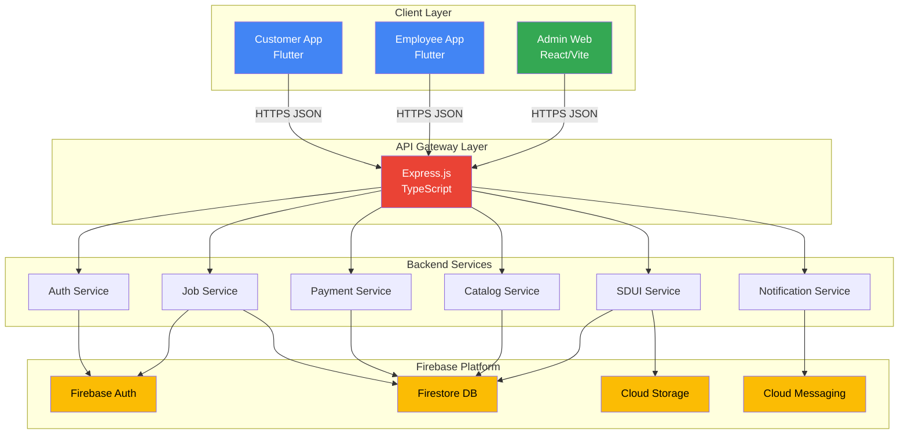

# System Overview Diagram



## Component Responsibilities

| Component | Responsibility | Key Files |
|-----------|---------------|-----------|
| Customer App | Service discovery, booking, payment | `mobile_customer/lib/features/*` |
| Employee App | Job management, earnings, location | `mobile_employee/lib/features/*` |
| Admin Web | Orchestration, catalog mgmt, analytics | `Admin/web_app/admin-dashboard/src/features/*` |
| Backend Server | API, business logic, Firebase integration | `backend_server/src/routes/*`, `backend_server/src/services/*` |

## Data Flow Summary

```
1. Customer selects service → SDUI fetches catalog from Firestore
2. Customer books service → POST /api/bookings
3. Backend creates Job + triggers notification
4. Employee picks up job → PATCH /api/jobs/:id
5. Employee completes work → POST /api/jobs/:id/complete
6. Admin views dashboard → GET /api/dashboard
```

## Environment Configuration

| Environment | Backend URL | Firebase Project |
|------------|-------------|------------------|
| Development | http://localhost:3000 | safecom-application-01 |
| Production | https://safecom-backend-*.cloudfunctions.net | safecom-application-01 |

## Confidence Level

**High** - Verified through code inspection of:
- `backend_server/src/app.ts` (route registration)
- `backend_server/src/middleware/firebaseAuth.ts` (auth flow)
- Mobile app API configuration files