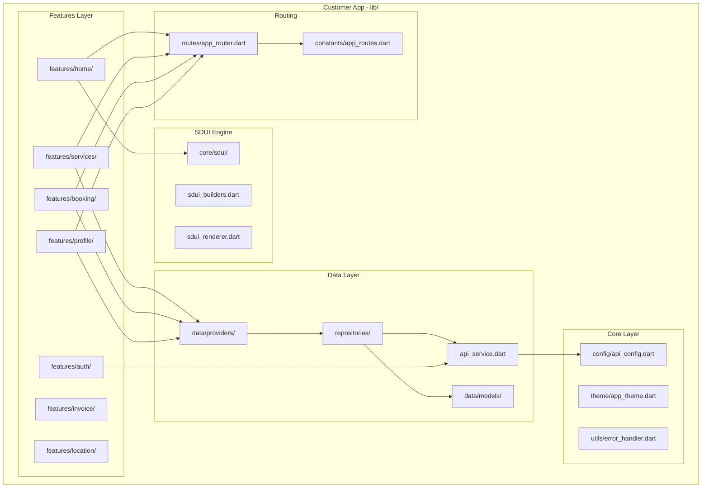
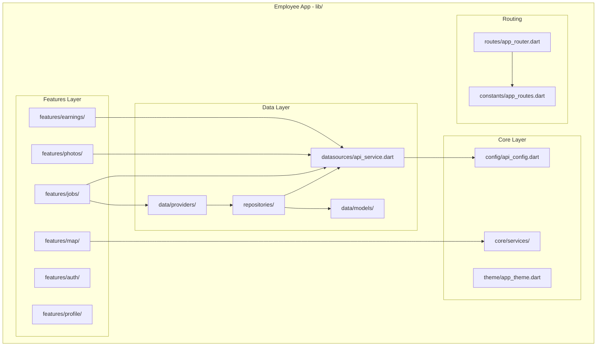
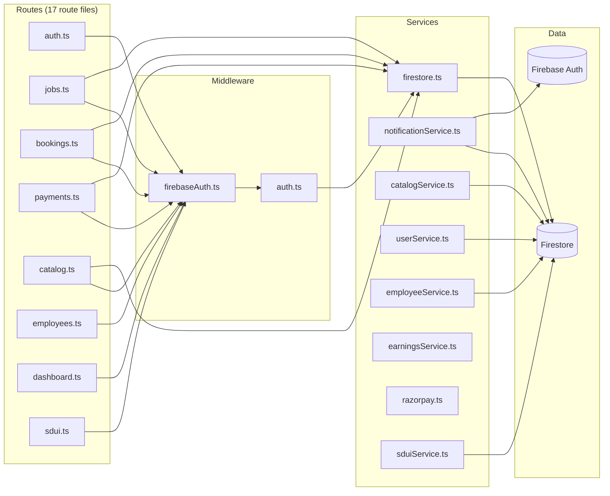
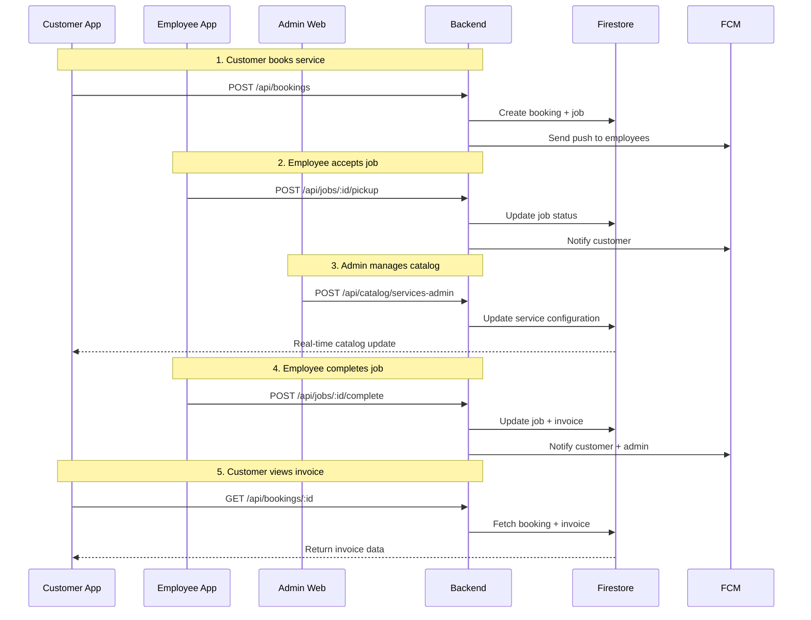

# Component Interaction Diagrams

## 1. Customer App Architecture



## 2. Employee App Architecture



## 3. Admin Web Architecture

```mermaid
flowchart TB
    subgraph "Admin Web - src/"
        subgraph "Core Layer"
            Config[core/config/api.ts]
            Hooks[core/hooks/]
            Services[core/services/]
        end

        subgraph "Data Layer"
            DS[data/datasources/]
            Models[data/models/]
        end

        subgraph "Features Layer"
            Dashboard[features/dashboard/]
            Jobs[features/jobs/]
            Customers[features/customers/]
            Technicians[features/technicians/]
            Catalog[features/catalog/]
            Payments[features/payments/]
            Auth[features/auth/]
        end

        subgraph "Widgets"
            Layout[widgets/common/main_layout.tsx]
        end

        Config --> DS
        Hooks --> Services
        DS --> Models
        Dashboard --> Config
        Jobs --> DS
        Customers --> DS
        Technicians --> DS
        Catalog --> DS
        Payments --> DS
        Layout --> Hooks
```

## 4. Backend Component Interactions



## 5. Cross-Component Data Flow



## Confidence Level

**High** - All component boundaries verified through file inspection and import statements across all applications.