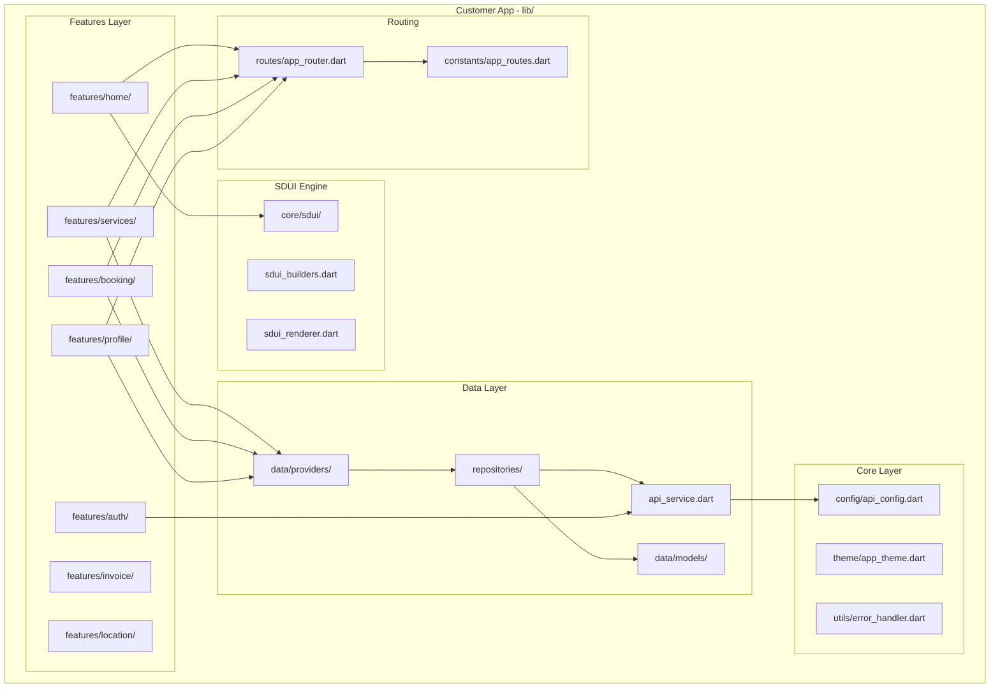
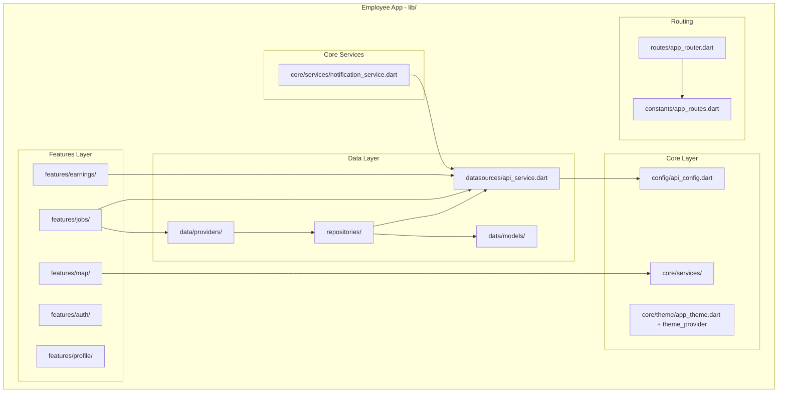
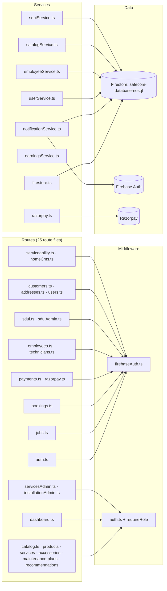
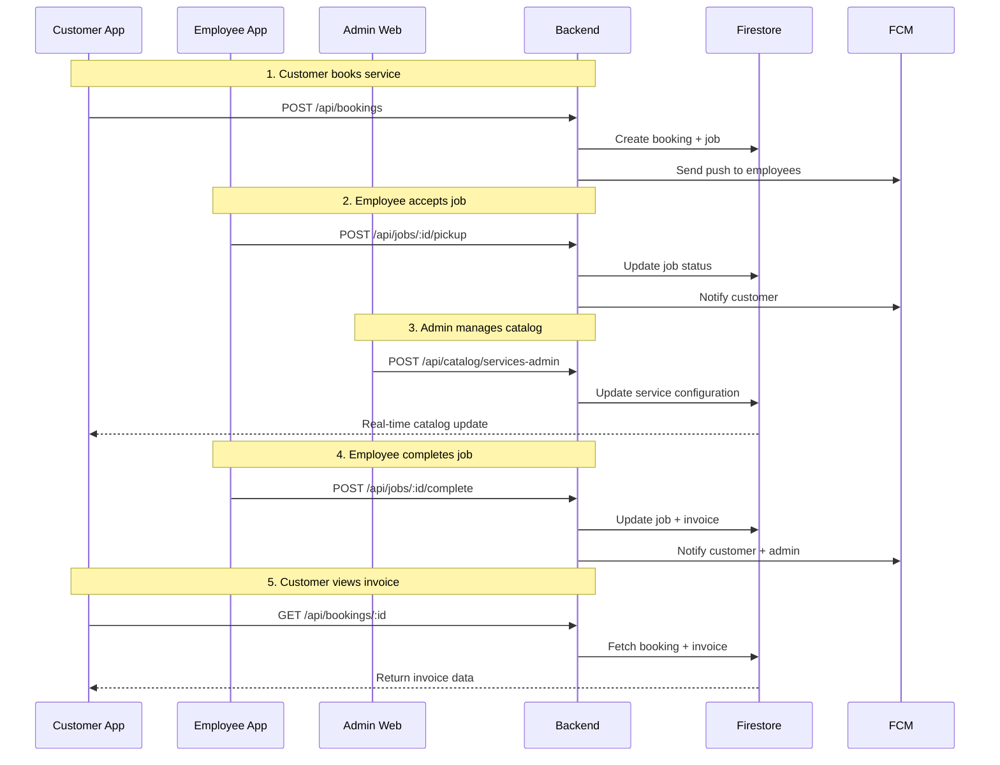

# Component Interaction Diagrams

## 1. Customer App Architecture



## 2. Employee App Architecture



> **Audit 2026-08-09**: `features/photos/` (photo capture + gallery) was removed;
> `core/services/notification_service.dart` (FCM) and `theme_provider.dart`
> (light/dark) were added.

## 3. Admin Web Architecture

```mermaid
flowchart TB
    subgraph "Admin Web - src/"
        subgraph "Core Layer"
            Config[core/config/api.ts]
            Hooks[core/hooks/]
            Services[core/services/]
        end

        subgraph "Data Layer"
            DS[data/datasources/]
            Models[data/models/]
        end

        subgraph "Features Layer"
            Dashboard[features/dashboard/]
            Jobs[features/jobs/]
            Customers[features/customers/]
            Technicians[features/technicians/]
            Catalog[features/catalog/]
            Payments[features/payments/]
            Auth[features/auth/]
            Settings[features/settings/]
            MobilePreview[features/mobile_preview/]
            Styles[features/styles/]
        end

        subgraph "Widgets"
            Layout[widgets/common/main_layout.tsx]
        end

        Config --> DS
        Hooks --> Services
        DS --> Models
        Dashboard --> Config
        Jobs --> DS
        Customers --> DS
        Technicians --> DS
        Catalog --> DS
        Payments --> DS
        Settings --> DS
        MobilePreview --> DS
        Layout --> Hooks
```

> **Audit 2026-08-09**: added `features/settings/` (serviceable areas),
> `features/mobile_preview/` (dual-phone SDUI preview), `features/styles/`;
> catalog consolidated (products/accessories/maintenance-plans merged into the
> catalog module, deduped).

## 4. Backend Component Interactions



> **Audit 2026-08-09**: routes grew 17 → 25; auth is tiered (Firebase ID tokens
> for mobile via `verifyFirebaseIdToken`, admin JWT + `requireRole` for
> management routes); Razorpay moved to its own route module with signature
> verification; Firestore uses the custom DB `safecom-database-nosql`.

## 5. Cross-Component Data Flow



## Confidence Level

**High** - All component boundaries verified through file inspection and import statements across all applications.

---

## Audit Update (2026-08-09)

1. Customer app: SDUI engine extended (promo banner `hideWhenServiceable`,
   component registry, feature flags); `features/cart/`, `features/info/`,
   `features/splash/`, `features/navigation/` modules added; guest-first auth.
2. Employee app: `features/photos/` removed; notification service + theme
   provider added.
3. Admin web: catalog consolidated; settings/mobile-preview/styles modules added.
4. Backend: see §4 diagram above (25 route files, tiered auth, Razorpay module).