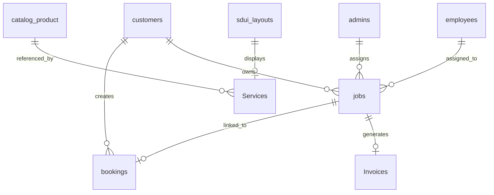

# Firestore Database Architecture

## Collection Overview

The system uses Firestore as its primary database with the following active collections:

### Primary Collections (current — verified 2026-08-09)

| Collection | Purpose | Document Count |
|------------|---------|-----------------|
| `admins` | Admin user profiles | Low (team size) |
| `customers` | Customer profiles (+ saved addresses, phone) | Medium |
| `employees` | Employee/technician profiles | Low-medium |
| `users` | Cross-role user lookup / linking | Low |
| `catalog_product` | Master product catalog | High |
| `Services` | Dynamic service tree (categories/setups/products/nodes/branches/clubs) | Low |
| `catalog_maintenance_plans` | **NEW** AMC/maintenance plan catalog | Low-medium |
| `jobs` | Job/work orders (carry invoice incl. custom message) | High |
| `bookings` | Customer bookings (bookingId-based) | High |
| `Invoices` | Invoice documents | Medium |
| `sdui_layouts` | Server-driven UI layouts | Low |
| `sdui_feature_flags` | **NEW** SDUI feature flags | Low |
| `serviceable_areas` | **NEW** Serviceable pincode/area registry | Low-medium |
| `home_cms` | **NEW** Home page CMS content | Low |
| `booking_counters` | **NEW** Sequential booking-id counters | Low |

> ⚠️ `firestore.rules` still references legacy names (`PService`, `Catalog_Product`,
> `Customer_User`, `Orders`, `Employee_User`, `Admin_User`, `Bookings`,
> `Configurations`, `Banners`, `Offers`, `Locations`). The backend uses the admin
> SDK (bypasses rules) and `firestore.indexes.json` defines only 3 indexes — both
> should be reconciled with the collection set above.

### Legacy/Deleted Collections

- `customer_user` → migrated to `customers`
- `admin_user` → migrated to `admins`
- `employee_user` → migrated to `employees`
- `Banners`, `Bookings` (old), `Configurations`, `Locations`, `Offers`, `Orders`, `PService`, `Catalog_Product`, `Customer_User`, `Employee_User`, `Admin_User` → no longer used by the backend

## Document Schema

### admins

```typescript
{
  uid: string;           // Firebase UID
  email: string;
  name: string;
  role: 'admin';
  status: 'active' | 'inactive';
  createdAt: string;      // ISO 8601
  firebaseUid: string;   // Linked Firebase auth ID
}
```

### customers

```typescript
{
  uid: string;           // Firebase UID
  name: string;
  phone: string;        // now persisted on profile (optional email)
  email?: string;
  profileImage?: string;
  defaultLocationId?: string;
  savedLocations: Location[];  // addresses now carry lat/lng from the map picker
  status: 'active' | 'inactive';
  createdAt: string;      // ISO 8601
}
```

### employees

```typescript
{
  uid: string;
  name: string;
  phone: string;
  email: string;
  role: string;
  department: string;
  status: 'active' | 'inactive' | 'on-leave';
  createdAt: string;
}
```

### catalog_product (Master Product)

```typescript
{
  id: string;            // e.g., "PROD001"
  sku: string;
  name: string;
  category: string;      // e.g., "NVR", "Camera", "HDD"
  group: string;
  brand?: string;
  price: number;
  unit: string;
  status: 'active' | 'inactive';
  stockEnabled: boolean;
  visible: boolean;
  images: string[];
  tags: string[];
  createdAt: string;
  updatedAt: string;
}
```

### jobs

```typescript
{
  jobId: string;         // Custom ID (not Firestore doc ID)
  bookingId: string;
  customerId: string;
  serviceType: 'installation' | 'maintenance' | 'amc' | 'repair' | 'upgrade';
  status: 'pending' | 'assigned' | 'in_progress' | 'completed' | 'cancelled';
  assignedTo: {
    employeeId: string;
    name: string;
    phone: string;
  };
  location: {
    address: string;
    city: string;
    pincode: string;
  };
  items: JobItem[];
  subtotal: number;
  tax: number;
  discount: number;
  total: number;
  paymentStatus: 'unpaid' | 'paid' | 'partial';
  invoice?: CanonicalInvoice; // incl. customTextBox (customer message)
  scheduledDate: string;
  completedAt?: string;
  completionNotes?: string;
  createdAt: string;
  updatedAt: string;
}
```

### catalog_maintenance_plans (NEW)

```typescript
{
  id: string;
  name: string;
  description?: string;
  frequency: 'monthly' | 'quarterly' | 'half_yearly' | 'yearly';
  price: number;
  status: 'active' | 'inactive';
  createdAt: string;
  updatedAt: string;
}
```

### serviceable_areas (NEW)

```typescript
{
  areaCode: string;      // e.g. pincode or area id
  name: string;
  city: string;
  status: 'active' | 'inactive';
  // shared between admin CRUD, backend /serviceability/check, and SDUI
}
```

### home_cms (NEW)

```typescript
{
  // promo banners, sections, feature flags rendered by the home screen / SDUI
}
```

### bookings

```typescript
{
  id: string;
  customerId: string;
  orderId: string;
  serviceId: string;
  variantId?: string;
  locationId: string;
  items: BookingItem[];
  subtotal: number;
  tax: number;
  discount: number;
  total: number;
  status: 'pending' | 'confirmed' | 'assigned' | 'in_progress' | 'completed' | 'cancelled';
  paymentStatus: 'unpaid' | 'paid' | 'partial';
  scheduledDate: string;
  createdAt: string;
}
```

### Services (Nested Tree Structure)

```typescript
{
  id: string;            // e.g., "Installation", "AMC", "Repair"
  name: string;
  key: string;
  description?: string;
  icon?: string;
  status: 'active' | 'inactive';
  // Dynamic nested structure:
  // {
  //   "4 Camera Setup": {
  //     "Product 1": {
  //       "Option 1": {
  //         "Price": Firestore DocumentReference,
  //         "Product 1 Option 1 ID": Firestore DocumentReference,
  //         "defaultQty": 4,
  //         "minQty": 1,
  //         "maxQty": 4,
  //         "available": true,
  //         "rigid": false
  //       }
  //     }
  //   }
  // }
}
```

## Collection Relationships



## Indexing Strategy

Based on code analysis:
- `jobs` collection has queries on: `jobId`, `status`, `assignedTo.employeeId`, `createdAt`
- `customers` queries on: `firebaseUid`, `email`, `phone`
- `employees` queries on: `uid`, `status`

**Note**: The jobs route uses in-memory filtering (see `backend_server/src/routes/jobs.ts:31-69`) to avoid composite index requirements. This is a performance concern at scale.

## Denormalization Analysis

The system uses limited denormalization:
- `jobs` contains both customerId and location data (potential duplication)
- `bookings` mirrors job data for customer-facing views

**Hot Collections** (high read/write frequency):
1. `jobs` - Constant read/write for job tracking
2. `bookings` - High for customer interactions
3. `catalog_product` - High read for service discovery

## Security Rules

The `firestore.rules` file exists but was not reviewed in detail. Assumed rules:
- Admins: Full read/write access
- Employees: Read jobs, update own assignments
- Customers: Read own bookings/jobs only

## Confidence Level

**High** - Schema inferred from:
- `backend_server/src/types.ts`
- `database-architecture/COLLECTIONS.md` (updated 2026-08-09)
- `backend_server/src/contracts/canonical_contracts.ts`
- `backend_server/src/routes/*.ts` collection usage (verified 2026-08-09)
- Firestore collection snapshots

---

## Audit Update (2026-08-09)

Collections **added** since the 2026-05-09 snapshot:
`users`, `catalog_maintenance_plans`, `sdui_feature_flags`, `serviceable_areas`,
`home_cms`, `booking_counters`. Booking/`jobs` schemas now include the customer's
custom message (`invoice.customTextBox`) and advance payment fields
(`amountPaid`/`totalAmount`). `firestore.rules` + `firestore.indexes.json` are
stale vs. the runtime collection set (see Audit Delta §3/§8).