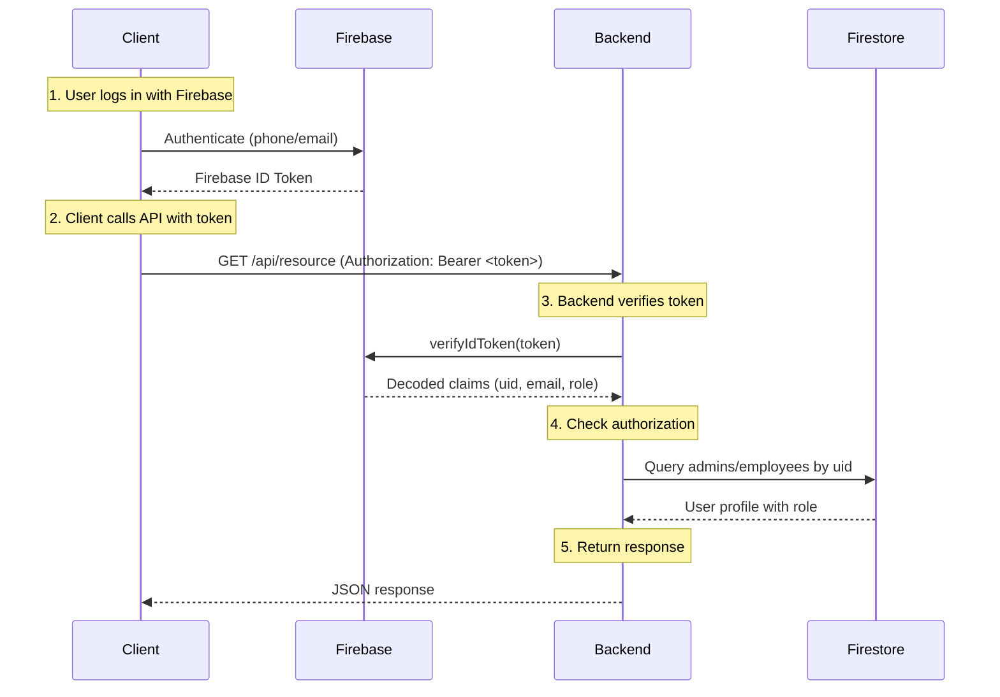
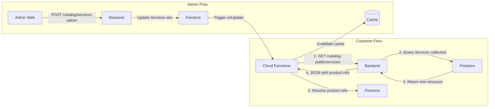
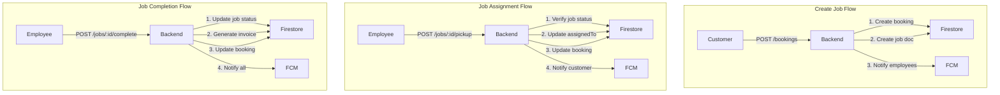
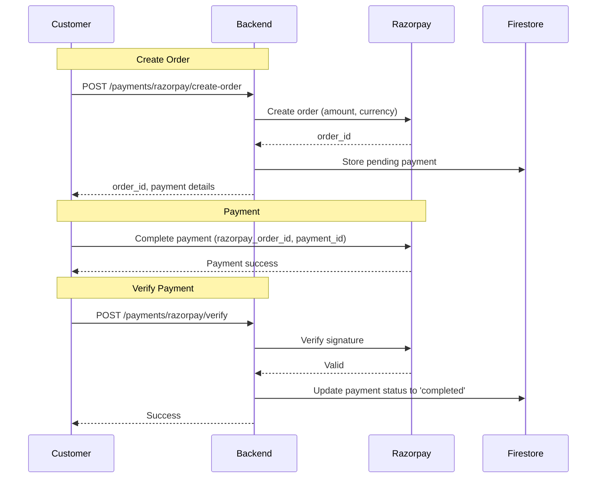
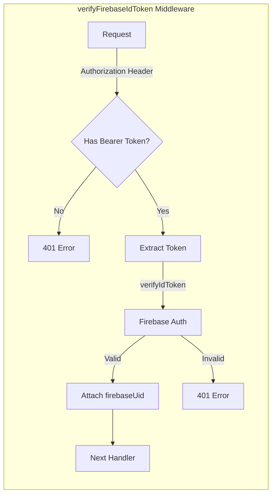

# API Flow Analysis

## API Entry Points

### Public Endpoints (No Auth Required)

| Method | Endpoint | Description |
|--------|----------|-------------|
| GET | `/health` | Health check (deployed dual-region) |
| POST | `/api/auth/login` | Login (Firebase ID token) |
| GET | `/api/auth/health` | Auth service health |
| GET | `/api/catalog-public/*` | Service catalog, pricing, upgrade, accessories, products, recommendations (read-only) |
| GET | `/api/sdui/layout` `/api/sdui/screens` | SDUI layouts (public) |
| GET | `/api/home-cms/` | Home CMS content (public read) |
| POST | `/api/serviceability/check` | Location serviceability check (public) |
| GET | `/api/serviceability/areas` | Serviceable areas (public read) |
| GET | `/api/catalog/services` `/accessories` `/maintenance-plans` `/recommendations` | Read-only catalog views |

### Firebase-Token Endpoints (mobile clients, `verifyFirebaseIdToken`)

| Method | Endpoint | Description |
|--------|----------|-------------|
| POST | `/api/auth/logout` | Logout |
| GET | `/api/users/me` `/by-phone/:phone` `/by-email/:email` | Customer lookup/dup-check |
| GET/POST/PATCH/DELETE | `/api/customers/*` | Customer profile + saved addresses |
| GET/POST/PATCH/DELETE | `/api/jobs/*` | Job lifecycle (incl. `/:id/pickup`, `/:id/complete`) |
| POST/GET/PATCH | `/api/bookings/*` | Booking management (creates job) |
| POST | `/api/payments/razorpay/create-order` `/verify` | Razorpay order + signature verify |
| GET | `/api/employees/me` `/:id` `/:id/earnings` | Employee profile/earnings |
| POST | `/api/employees/device-token` | FCM device token registration |
| GET | `/api/catalog/metadata` `/pricing` `/packages` `/addons` `/taxes` `/invoices` | Catalog reads |

### Admin-Token Endpoints (`authenticateToken` + `requireRole`)

| Method | Endpoint | Description |
|--------|----------|-------------|
| GET | `/api/dashboard/*` | Analytics & metrics |
| GET/POST/PATCH/DELETE | `/api/customers/*` | Customer management (admin) |
| GET/POST/PATCH/DELETE | `/api/technicians/*` | Technician CRUD + passwords |
| GET/POST/PATCH/DELETE | `/api/payments/*` | Payment records (+ `/:id/request`) |
| GET/POST/PATCH/DELETE | `/api/catalog/services-admin/*` | Dynamic service tree builder |
| GET/POST/PATCH/DELETE | `/api/catalog/installation-admin/*` | Installation tree builder |
| GET/POST/PATCH/DELETE | `/api/catalog/sdui-admin/*` | SDUI layouts + feature flags |
| GET/POST/PATCH/DELETE | `/api/catalog/*` (metadata, packages, addons, taxes, invoices, products, maintenance-plans, accessories) | Catalog management |
| POST | `/api/catalog/services` `/accessories` `/maintenance-plans` `/recommendations` | Catalog writes |
| POST/PATCH/DELETE | `/api/serviceability/areas` | Area CRUD (admin) |
| GET/POST/PATCH/DELETE | `/api/home-cms` | Home CMS admin |

## Request Lifecycle

```mermaid
flowchart TB
    Client[Client App] -->|HTTP Request| CDN[CDN / Load Balancer]
    CDN -->|Forward| Express[Express.js Server]

    subgraph "Middleware Pipeline"
        Helmet[Helmet.js - Security Headers]
        CORS[CORS - Origin Validation]
        JSON[express.json() - Body Parser]
        Morgan[Morgan - Request Logging]
    end

    Express --> Helmet --> CORS --> JSON --> Morgan

    subgraph "Authentication"
        AuthM[firebaseAuth Middleware]
        Token[Verify Firebase ID Token]
        Claims[Extract UID + Claims]
    end

    Morgan --> AuthM --> Token --> Claims

    subgraph "Route Handler"
        Router[Route Matching]
        Controller[Controller Logic]
        Validation[Zod Validation]
        Service[Service Layer]
    end

    Claims --> Router --> Controller --> Validation --> Service

    subgraph "Data Layer"
        Firestore[Firestore Service]
        Query[Query Collection]
    end

    Service --> Firestore --> Query

    subgraph "Response"
        Transform[Response Transform]
        JSONResp[JSON Response]
    end

    Query --> Transform --> JSONResp --> Client
```

## Authentication Flow



## Catalog API Flow



## Job Management Flow



## Payment Flow (Razorpay Integration)



## Middleware Flow



## API Response Format

### Success Response
```json
{
  "success": true,
  "data": { ... },
  "timestamp": "2026-05-09T12:00:00.000Z"
}
```

### Error Response
```json
{
  "success": false,
  "error": {
    "code": "ERROR_CODE",
    "message": "Human readable message"
  },
  "timestamp": "2026-05-09T12:00:00.000Z"
}
```

### Paginated Response
```json
{
  "success": true,
  "data": [...],
  "pagination": {
    "page": 1,
    "limit": 20,
    "total": 100,
    "totalPages": 5
  },
  "timestamp": "2026-05-09T12:00:00.000Z"
}
```

## Audit Update (2026-08-09)

- Route files grew 17 → **25**; endpoint inventory above is the full current set.
- Auth is now tiered: public → Firebase-ID-token (mobile) → admin-JWT + `requireRole`.
- Payment verification now **requires** the Razorpay signature.
- `PATCH /customers/:id` allows customers to update their own profile (was admin-only).
- Response shape standardized to `{ success, data }`; error responses use `{ success: false, error: { code, message } }`.

## Confidence Level

**High** - Verified through:
- `backend_server/src/app.ts` (route registration)
- `backend_server/src/routes/*.ts` (handler implementations)
- `backend_server/src/middleware/firebaseAuth.ts` + `middleware/auth.ts` (auth flows)