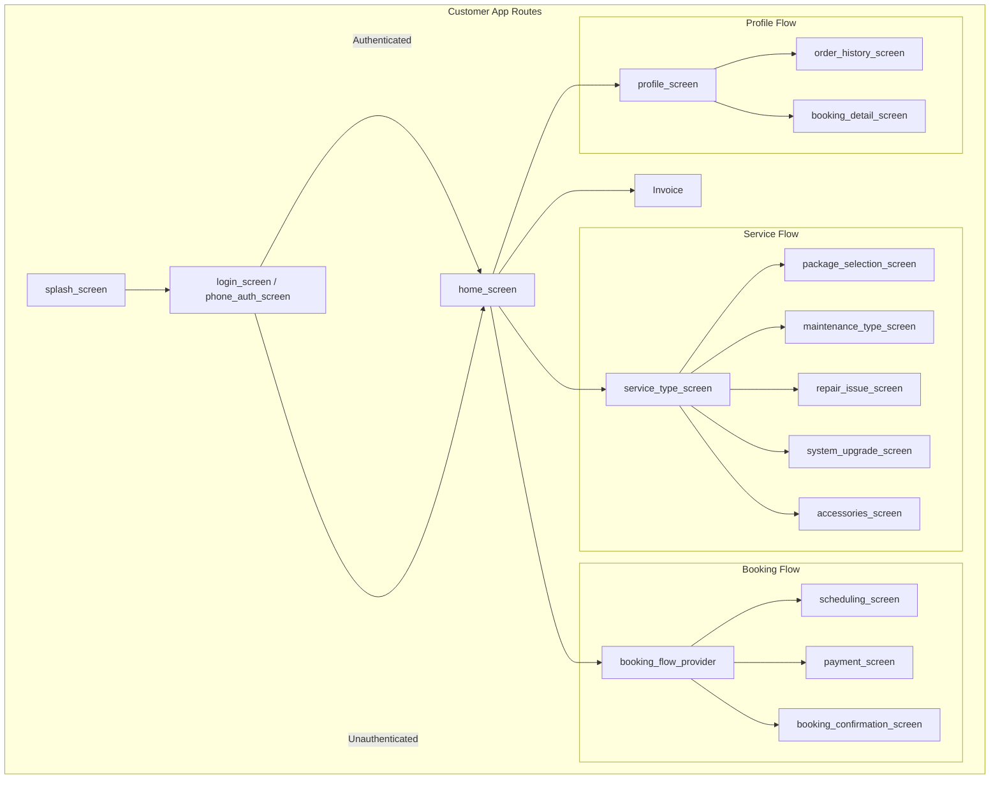
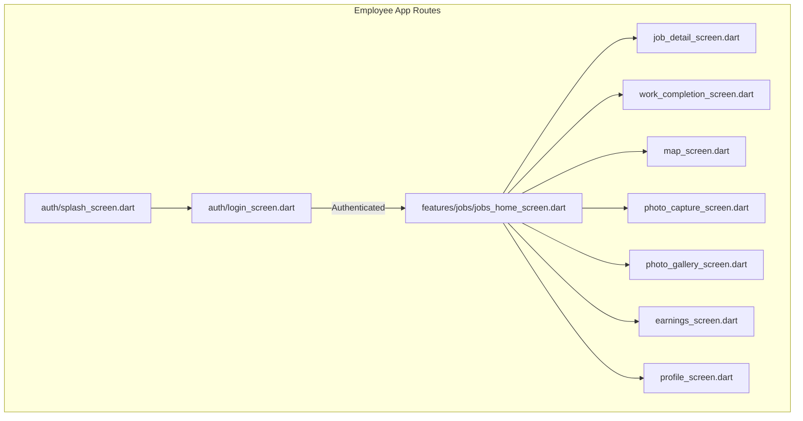

# Mobile App Navigation Flow

## Customer App Navigation

### Route Structure



### Route Definitions

| Screen | Route | Parameters | Guard |
|--------|-------|-------------|-------|
| Splash | `/` | - | None |
| Login | `/login` | - | None |
| Phone Auth | `/phone-auth` | - | None |
| Home | `/home` | - | Auth |
| Service Type | `/services` | - | Auth |
| Package Selection | `/services/package` | `serviceType` | Auth |
| Maintenance | `/services/maintenance` | - | Auth |
| Repair Issue | `/services/repair` | - | Auth |
| System Upgrade | `/services/upgrade` | - | Auth |
| Accessories | `/services/accessories` | - | Auth |
| Booking | `/booking/*` | `bookingId` | Auth |
| Payment | `/booking/payment` | - | Auth |
| Confirmation | `/booking/confirmation` | `bookingId` | Auth |
| Profile | `/profile` | - | Auth |
| Order History | `/profile/orders` | - | Auth |
| Booking Detail | `/profile/booking/:id` | `bookingId` | Auth |
| Location Picker | `/location-picker` | - | Auth |
| Invoice Estimate | `/invoice/*` | `type` | Auth |

### Navigation Implementation

**File**: `mobile_customer/lib/routes/app_router.dart`

```dart
// Using GoRouter or Navigator 2.0
// Routes defined with nested navigation support
```

**File**: `mobile_customer/lib/core/constants/app_routes.dart`

```dart
static const String home = '/home';
static const String login = '/login';
static const String phoneAuth = '/phone-auth';
static const String services = '/services';
static const String booking = '/booking';
static const String profile = '/profile';
// ... etc
```

## Employee App Navigation

### Route Structure



### Route Definitions

| Screen | Route | Parameters | Guard |
|--------|-------|-------------|-------|
| Splash | `/` | - | None |
| Login | `/login` | - | None |
| Jobs Home | `/jobs` | - | Auth |
| Job Detail | `/jobs/:id` | `jobId` | Auth |
| Work Completion | `/jobs/:id/complete` | `jobId` | Auth |
| Map | `/map` | - | Auth |
| Photo Capture | `/photos/capture` | `jobId` | Auth |
| Photo Gallery | `/photos/gallery` | `jobId` | Auth |
| Earnings | `/earnings` | - | Auth |
| Profile | `/profile` | - | Auth |

**File**: `mobile_employee/lib/routes/app_router.dart`
**File**: `mobile_employee/lib/core/constants/app_routes.dart`

## Deep Link Structure

| Deep Link | App | Target |
|-----------|-----|--------|
| `safecom://home` | Customer | Home Screen |
| `safecom://service/:type` | Customer | Service Type |
| `safecom://booking/:id` | Customer | Booking Detail |
| `safecom-employee://jobs` | Employee | Jobs Home |
| `safecom-employee://job/:id` | Employee | Job Detail |

## Navigation Patterns

### Customer App
1. **Bottom Navigation**: 3 tabs (Home, Bookings, Profile)
2. **Stack Navigation**: Push/pop for flows
3. **Modal**: Payment completion, location picker

### Employee App
1. **Bottom Navigation**: 3 tabs (Jobs, Map, Earnings)
2. **Stack Navigation**: Job detail, work completion
3. **Modal**: Photo capture

## Guarded Routes

```dart
// Pseudo-code for route guards
if (!isAuthenticated && route.requiresAuth) {
  return '/login';
}

if (isAuthenticated && route.isAuthOnly) {
  return '/home';
}
```

## Confidence Level

**High** - Navigation structure verified through:
- `mobile_customer/lib/routes/app_router.dart`
- `mobile_customer/lib/core/constants/app_routes.dart`
- `mobile_employee/lib/routes/app_router.dart`
- `mobile_employee/lib/core/constants/app_routes.dart`