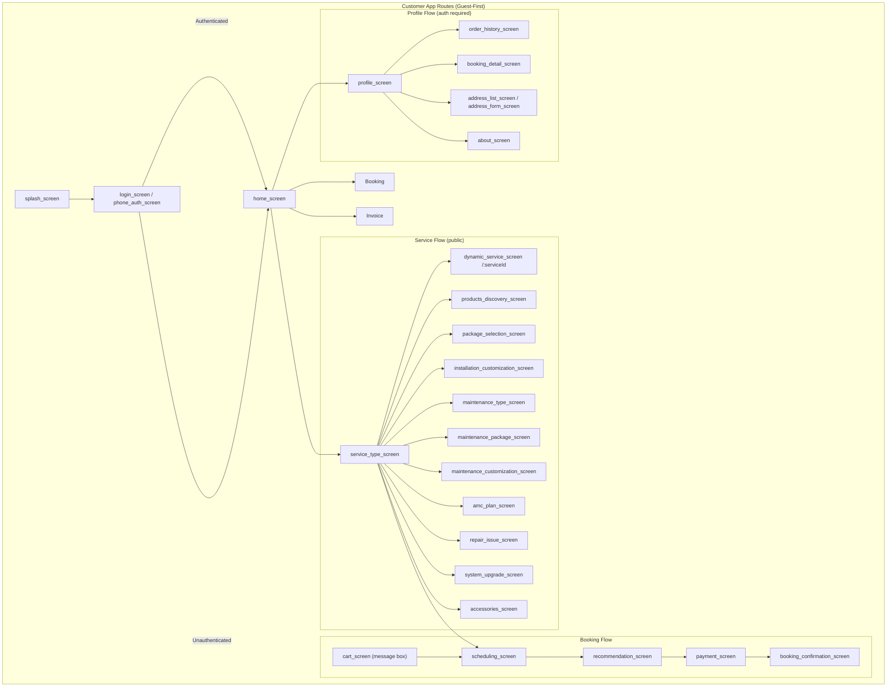
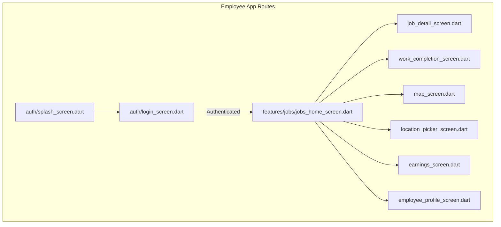

# Mobile App Navigation Flow

## Customer App Navigation

### Route Structure



### Route Definitions (current — verified 2026-08-09)

| Screen | Route | Parameters | Guard |
|--------|-------|-------------|-------|
| Splash | `/` | - | None |
| Login | `/login` | - | None |
| Phone Auth | `/phone-auth` | - | None |
| Phone Collection | `/phone-collection` | `continue` query | Auth + phone missing |
| Location Permission | `/location-permission` | - | None |
| Location Picker | `/location-picker` | - | None |
| Home | `/home` | - | None (guest-first) |
| Products Discovery | `/products-discovery` | - | None |
| Service Types | `/service-types` | - | None |
| Dynamic Service | `/service/:serviceId` | `serviceId` | None |
| Package Selection | `/package-selection` | - | None |
| Installation Customization | `/installation-customization` | - | None |
| Maintenance Types | `/maintenance-types` | - | None |
| Maintenance Package | `/maintenance-package-selection` | - | None |
| Maintenance Customization | `/maintenance-customization` | - | None |
| AMC Plans | `/amc-plans` | - | None |
| Repair Issues | `/repair-issues` | - | None |
| Repair Estimate | `/repair-estimate` | - | None |
| System Upgrade | `/system-upgrade` | - | None |
| Upgrade Estimate | `/upgrade-estimate` | `UpgradeBundle` extra | None |
| Accessories | `/accessories` | - | None |
| Accessories Estimate | `/accessories-estimate` | entries extra | None |
| Scheduling | `/scheduling` | - | None |
| Cart (sheet w/ message box) | in-app screen, not routed | - | None |
| Recommendation | `/recommendation(/:serviceType)` | `serviceType` | None |
| Payment | `/payment` | - | **Auth + phone** |
| Confirmation | `/confirmation` | - | **Auth + phone** |
| Profile | `/profile` | - | **Auth + phone** |
| Order History | `/order-history` | - | **Auth + phone** |
| Booking Detail | `/booking-detail` | `BookingModel` extra | **Auth + phone** |
| Address List | `/address-list` | - | None |
| Address Form | `/address-form` | `SavedAddress?` extra | None |
| About | `/about` | - | None |

**Auth guard**: only `payment`, `confirmation`, `profile`, `order-history`,
`booking-detail` require login (`authRequiredRoutes`). Logged-in users with no
saved phone are redirected to `/phone-collection?continue=...` for those routes.
Logged-in users are bounced off `/login` and `/phone-auth` to `/home`.

### Navigation Implementation

**File**: `mobile_customer/lib/routes/app_router.dart`

```dart
// Using GoRouter or Navigator 2.0
// Routes defined with nested navigation support
```

**File**: `mobile_customer/lib/core/constants/app_routes.dart`

```dart
static const String home = '/home';
static const String login = '/login';
static const String phoneAuth = '/phone-auth';
static const String services = '/services';
static const String booking = '/booking';
static const String profile = '/profile';
// ... etc
```

## Employee App Navigation

### Route Structure



> Photo capture / photo gallery screens were **removed** (camera feature dropped, 2026-07).

### Route Definitions (current — verified 2026-08-09)

| Screen | Route | Parameters | Guard |
|--------|-------|-------------|-------|
| Splash | `/` | - | None |
| Login | `/login` | - | None |
| Jobs Home | `/jobs` | - | Auth |
| Job Detail | `/job-detail` | `AssignedJob` extra | Auth |
| Work Completion | `/work-completion` | `WorkCompletion` extra | Auth |
| Map | `/map` | `job` / `jobs` extra | Auth |
| Location Picker | `/location-picker` | - | Auth |
| Earnings | `/earnings` | - | Auth |
| Profile | `/profile` (alias `/employee-profile`) | - | Auth |

**File**: `mobile_employee/lib/routes/app_router.dart`
**File**: `mobile_employee/lib/core/constants/app_routes.dart`

## Deep Link Structure

| Deep Link | App | Target |
|-----------|-----|--------|
| `safecom://home` | Customer | Home Screen |
| `safecom://service/:type` | Customer | Service Type |
| `safecom://booking/:id` | Customer | Booking Detail |
| `safecom-employee://jobs` | Employee | Jobs Home |
| `safecom-employee://job/:id` | Employee | Job Detail |

## Navigation Patterns

### Customer App
1. **Bottom Navigation**: 3 tabs (Home, Bookings, Profile)
2. **Stack Navigation**: Push/pop for flows
3. **Modal**: Payment completion, location picker

### Employee App
1. **Bottom Navigation**: 3 tabs (Jobs, Map, Earnings)
2. **Stack Navigation**: Job detail, work completion
3. **Modal**: Photo capture

## Guarded Routes

```dart
// Pseudo-code for route guards
if (!isAuthenticated && route.requiresAuth) {
  return '/login';
}

if (isAuthenticated && route.isAuthOnly) {
  return '/home';
}
```

## Confidence Level

**High** - Navigation structure verified through:
- `mobile_customer/lib/routes/app_router.dart`
- `mobile_customer/lib/core/constants/app_routes.dart`
- `mobile_employee/lib/routes/app_router.dart`
- `mobile_employee/lib/core/constants/app_routes.dart`

---

## Audit Update (2026-08-09)

- Customer app moved to **guest-first**: only 5 routes require auth; new phone
  collection gate; ~30 registered routes (was ~17).
- Service flow is now one **dynamic service screen** (`/service/:serviceId`)
  rendering any admin-built service, plus dedicated estimate/customization screens.
- Employee app: photo capture/gallery routes removed; map + location picker,
  earnings, and profile remain; job data passed via GoRouter `extra`.
- See **[21_UI_UX](../21_UI_UX/README.md)** for screen-by-screen UI/UX flows.