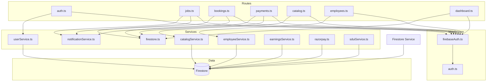
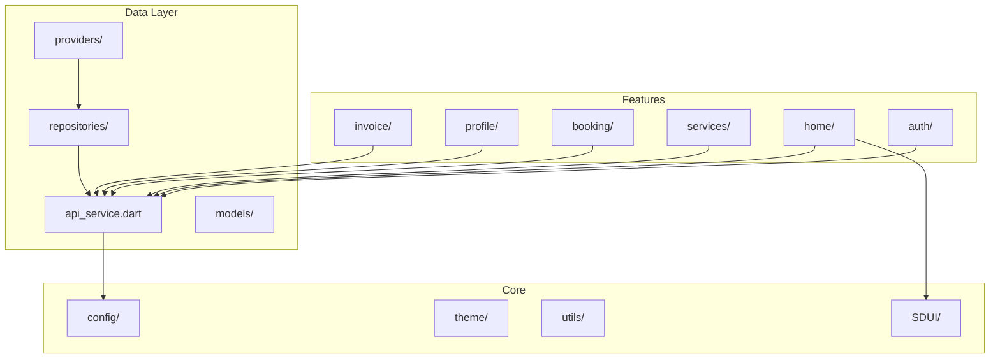
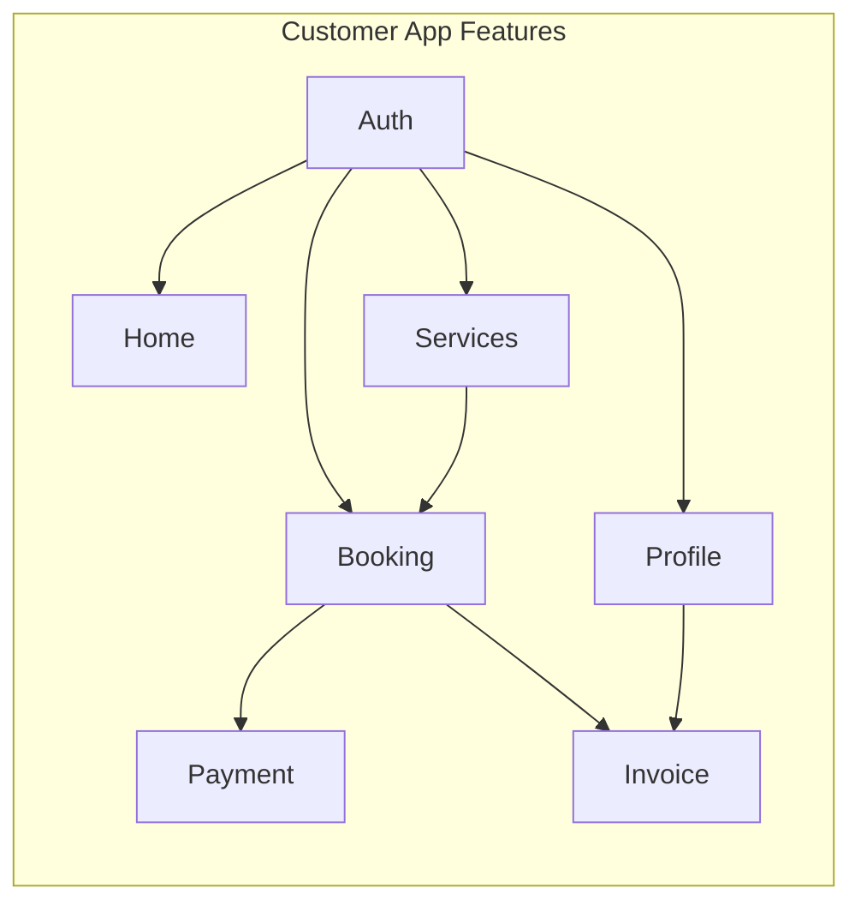

# Dependency Graphs

## 1. Backend Module Dependencies



## 2. Customer App Dependencies



## 3. Circular Dependency Check

### Backend
No circular dependencies found:
- Routes → Services → Firestore (linear)
- Middleware → Services (no cycles)

### Mobile Apps
Potential issues:
- Provider → Repository → Provider (possible circular if not careful)
- No problematic cycles detected

## 4. Package-Level Graph

### Backend (package.json)
```json
{
  "dependencies": {
    "express": "^4.21.2",       // HTTP framework
    "firebase-admin": "^12.7.0", // Firebase SDK
    "jsonwebtoken": "^9.0.2",   // JWT handling
    "zod": "^3.24.3",           // Validation
    "helmet": "^8.1.0",         // Security
    "cors": "^2.8.5",           // CORS
    "morgan": "^1.10.0",        // Logging
    "dotenv": "^16.5.0"         // Config
  }
}
```

### Customer App (pubspec.yaml - assumed)
```yaml
dependencies:
  flutter:
    sdk: flutter
  riverpod: ^2.x          # State management
  dio: ^5.x               # HTTP client
  go_router: ^13.x        # Navigation
  firebase_core: ^3.x     # Firebase
  firebase_auth: ^4.x     # Auth
  cloud_firestore: ^5.x  # Firestore
```

### Employee App (pubspec.yaml - assumed)
```yaml
dependencies:
  flutter:
    sdk: flutter
  riverpod: ^2.x
  dio: ^5.x
  go_router: ^13.x
  firebase_core: ^3.x
  firebase_auth: ^4.x
  cloud_firestore: ^5.x
  # Additional for employee
  google_maps_flutter: ^2.x
  geolocator: ^11.x
```

## 5. Feature Dependency Graph



## Dependency Issues

### Issue 1: Dual HTTP Clients
Both mobile apps use `dio` but maintain separate instances.

**Fix**: Share via `safecom_core` package

### Issue 2: Shared Theme Duplication
Themes defined separately but serve same purpose.

**Fix**: Extract to shared package with theming config

### Issue 3: Repository Pattern Inconsistency
Customer app has repositories; Employee app has datasources + repositories.

**Fix**: Standardize on one pattern across apps

## Confidence Level

**High** - Dependency structure verified through import analysis across all code files.