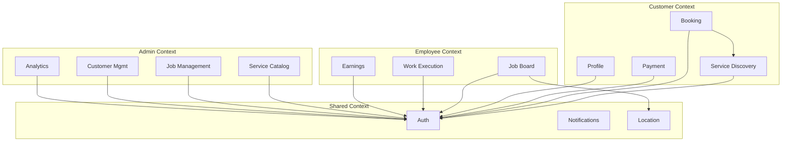

# Service Boundaries & Domain Analysis

## Identified Domain Modules

### 1. Authentication Domain
**Owner**: Firebase Auth → Backend `auth.ts`

**Boundaries**:
- Handles login, logout, token validation
- Routes: `/api/auth/*`
- No authentication logic in services (delegated to middleware)

### 2. Service Catalog Domain
**Owner**: Backend `catalogService.ts`, Mobile `ServiceCatalogRepository`

**Boundaries**:
- Product master data (`catalog_product` collection)
- Service configuration tree (`Services` collection)
- Pricing rules
- Routes: `/api/catalog/*`, `/api/catalog-public/*`

### 3. Booking Domain
**Owner**: Backend `bookings.ts`, Mobile `BookingFlowProvider`

**Boundaries**:
- Booking creation, scheduling, modification
- Links to Jobs
- Routes: `/api/bookings/*`

### 4. Job Management Domain
**Owner**: Backend `jobs.ts`, Employee App

**Boundaries**:
- Job lifecycle (pending → assigned → in_progress → completed)
- Assignment to employees
- Work completion
- Routes: `/api/jobs/*`

### 5. Payment Domain
**Owner**: Backend `payments.ts`, `razorpay.ts`

**Boundaries**:
- Payment processing (Razorpay integration)
- Invoice generation
- Payment verification
- Routes: `/api/payments/*`

### 6. Notification Domain
**Owner**: Backend `notificationService.ts`

**Boundaries**:
- Push notifications via FCM
- Job status notifications
- Payment notifications

### 7. Employee Management Domain
**Owner**: Backend `employees.ts`, `employeeService.ts`

**Boundaries**:
- Employee profiles
- Earnings calculation
- Employee-specific job queries

### 8. Analytics Domain
**Owner**: Backend `dashboard.ts`

**Boundaries**:
- Metrics calculation
- Dashboard data aggregation

### 9. UI Configuration Domain
**Owner**: Backend `sdui.ts`, `sduiAdmin.ts`, `sduiService.ts`

**Boundaries**:
- Dynamic layout configurations
- Server-driven UI rendering
- Feature flags (`sdui_feature_flags`)

### 10. Serviceability Domain (NEW)
**Owner**: Backend `serviceability.ts`, Admin `features/settings/serviceable_areas_screen.tsx`

**Boundaries**:
- Serviceable-area registry (`serviceable_areas` collection)
- `POST /api/serviceability/check` for map validation
- Shared with SDUI (`hideWhenServiceable` promo banners) and admin CRUD

### 11. Home CMS Domain (NEW)
**Owner**: Backend `homeCms.ts`, Admin mobile preview

**Boundaries**:
- Home page promo banners/sections (`home_cms` collection)
- Public read (`GET /api/home-cms/`), admin write
- SDUI injection from the admin dashboard's dual-phone mobile preview

### 12. Maintenance Plans Domain (NEW)
**Owner**: Backend `maintenance-plans.ts`, customer `amc_plan_screen.dart`

**Boundaries**:
- AMC/maintenance plan catalog (`catalog_maintenance_plans` collection)
- Frequency-based plans (monthly/quarterly/half-yearly/yearly)

### 13. Dynamic Service Tree Domain (NEW)
**Owner**: Backend `servicesAdmin.ts` + `installationAdmin.ts`, customer `dynamic_service_screen.dart`

**Boundaries**:
- Admin-built service trees: categories → setups → products → options → branches/clubs
- Quantity/dependency engine (auto-mapped product quantities)
- Rendered generically by the customer's `DynamicServiceScreen`

## Bounded Contexts

## Coupling Analysis

### Tight Coupling
1. **Jobs ↔ Bookings**: Bidirectional updates
2. **Payments ↔ Jobs**: Payment status reflects in job
3. **Catalog ↔ Services**: Services reference products

### Loose Coupling
1. **Auth ↔ Other domains**: Middleware handles auth independently
2. **Notifications**: Async, non-blocking

## Ownership Boundaries

| Domain | Owner | API Ownership |
|--------|-------|---------------|
| Auth | Backend Team | `/api/auth/*` |
| Catalog | Backend + Admin | `/api/catalog/*`, `/api/catalog-public/*` |
| Service Tree | Admin + Backend | `/api/catalog/services-admin/*`, `/api/catalog/installation-admin/*` |
| SDUI / CMS | Admin + Backend | `/api/catalog/sdui-admin/*`, `/api/home-cms/*` |
| Serviceability | Admin + Backend + Customer | `/api/serviceability/*` |
| Maintenance Plans | Backend + Customer | `/api/catalog/maintenance-plans/*` |
| Bookings | Customer App + Backend | `/api/bookings/*` |
| Jobs | Employee App + Backend | `/api/jobs/*` |
| Payments | Backend | `/api/payments/*`, `/api/payments/razorpay/*` |
| Addresses | Customer App + Backend | `/api/customers/:customerId/addresses/*` |
| Customer Lookup | Backend | `/api/users/*` |

## Confidence Level

**High** - Domain boundaries identified through route organization and service layer separation.

---

## Audit Update (2026-08-09)

Five new domains since the 2026-05-09 snapshot: **Serviceability**, **Home CMS**,
**Maintenance Plans**, **Dynamic Service Tree** (servicesAdmin + installationAdmin),
and **Addresses/User lookup** (`addresses.ts`, `users.ts`). The catalog domain now
spans 6 route files (products, services, accessories, maintenance-plans,
recommendations, servicesAdmin, installationAdmin). Notifications are now also
wired into the employee app (FCM device tokens via `/api/employees/device-token`).