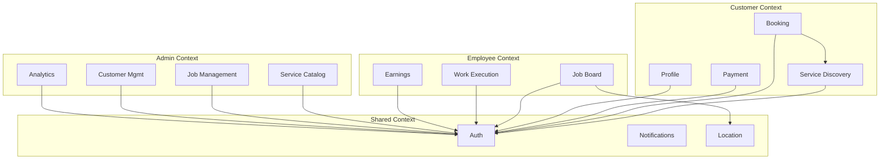

# Service Boundaries & Domain Analysis

## Identified Domain Modules

### 1. Authentication Domain
**Owner**: Firebase Auth → Backend `auth.ts`

**Boundaries**:
- Handles login, logout, token validation
- Routes: `/api/auth/*`
- No authentication logic in services (delegated to middleware)

### 2. Service Catalog Domain
**Owner**: Backend `catalogService.ts`, Mobile `ServiceCatalogRepository`

**Boundaries**:
- Product master data (`catalog_product` collection)
- Service configuration tree (`Services` collection)
- Pricing rules
- Routes: `/api/catalog/*`, `/api/catalog-public/*`

### 3. Booking Domain
**Owner**: Backend `bookings.ts`, Mobile `BookingFlowProvider`

**Boundaries**:
- Booking creation, scheduling, modification
- Links to Jobs
- Routes: `/api/bookings/*`

### 4. Job Management Domain
**Owner**: Backend `jobs.ts`, Employee App

**Boundaries**:
- Job lifecycle (pending → assigned → in_progress → completed)
- Assignment to employees
- Work completion
- Routes: `/api/jobs/*`

### 5. Payment Domain
**Owner**: Backend `payments.ts`, `razorpay.ts`

**Boundaries**:
- Payment processing (Razorpay integration)
- Invoice generation
- Payment verification
- Routes: `/api/payments/*`

### 6. Notification Domain
**Owner**: Backend `notificationService.ts`

**Boundaries**:
- Push notifications via FCM
- Job status notifications
- Payment notifications

### 7. Employee Management Domain
**Owner**: Backend `employees.ts`, `employeeService.ts`

**Boundaries**:
- Employee profiles
- Earnings calculation
- Employee-specific job queries

### 8. Analytics Domain
**Owner**: Backend `dashboard.ts`

**Boundaries**:
- Metrics calculation
- Dashboard data aggregation

### 9. UI Configuration Domain
**Owner**: Backend `sdui.ts`, `sduiService.ts`

**Boundaries**:
- Dynamic layout configurations
- Server-driven UI rendering

## Bounded Contexts

## Coupling Analysis

### Tight Coupling
1. **Jobs ↔ Bookings**: Bidirectional updates
2. **Payments ↔ Jobs**: Payment status reflects in job
3. **Catalog ↔ Services**: Services reference products

### Loose Coupling
1. **Auth ↔ Other domains**: Middleware handles auth independently
2. **Notifications**: Async, non-blocking

## Ownership Boundaries

| Domain | Owner | API Ownership |
|--------|-------|---------------|
| Auth | Backend Team | `/api/auth/*` |
| Catalog | Backend + Admin | `/api/catalog/*` |
| Bookings | Customer App + Backend | `/api/bookings/*` |
| Jobs | Employee App + Backend | `/api/jobs/*` |
| Payments | Backend | `/api/payments/*` |

## Confidence Level

**High** - Domain boundaries identified through route organization and service layer separation.