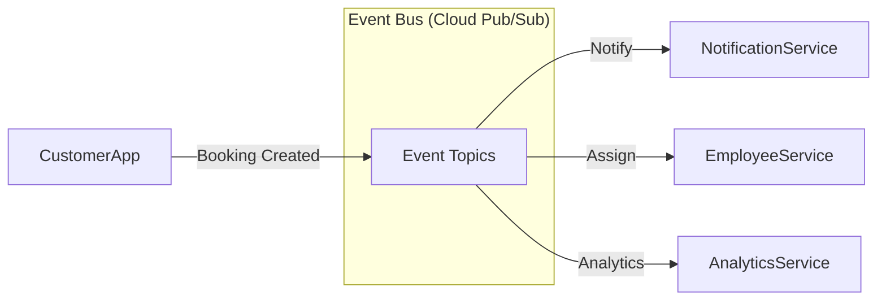

# Microservice Architecture Suggestions

## Current Monolithic Backend

Currently, the backend is a single Express.js server with 17 route files. As the system scales, consider splitting into microservices.

## Proposed Service Split

### 1. Auth Service

**Responsibilities**:
- Firebase token validation
- User role lookup
- Session management

**Boundaries**:
- Endpoint: `/api/auth/*`
- Database: `admins`, `customers`, `employees` (read-only)

**Migration Complexity**: Low
- Can extract and deploy independently
- No data changes required

### 2. Catalog Service

**Responsibilities**:
- Product CRUD
- Service tree management
- Pricing logic

**Boundaries**:
- Endpoint: `/api/catalog/*`
- Database: `catalog_product`, `Services`

**Migration Complexity**: Medium
- Most read-heavy, can scale independently
- Needs caching layer

### 3. Order/Job Service

**Responsibilities**:
- Job lifecycle management
- Booking management
- Employee assignment

**Boundaries**:
- Endpoint: `/api/jobs/*`, `/api/bookings/*`
- Database: `jobs`, `bookings`

**Migration Complexity**: High
- Core to system
- Complex relationships

### 4. Payment Service

**Responsibilities**:
- Payment processing
- Razorpay integration
- Invoice generation

**Boundaries**:
- Endpoint: `/api/payments/*`
- Database: `payments`, `invoices`

**Migration Complexity**: Medium
- Can separate due to compliance isolation

### 5. Notification Service

**Responsibilities**:
- FCM push notifications
- Email triggers
- In-app notifications

**Boundaries**:
- Async (event-driven)
- Database: notification queue

**Migration Complexity**: Low
- Pure event consumer
- Can be serverless (Cloud Functions)

### 6. Employee Service

**Responsibilities**:
- Employee profile management
- Earnings calculation
- Location tracking

**Boundaries**:
- Endpoint: `/api/employees/*`
- Database: `employees`

**Migration Complexity**: Medium
- Separate domain
- Can use eventual consistency

### 7. Analytics Service

**Responsibilities**:
- Dashboard metrics
- Aggregations
- Reporting

**Boundaries**:
- Endpoint: `/api/dashboard/*`
- Database: Read-only from other collections

**Migration Complexity**: Low
- Read-only service
- Can use read replicas

## Event-Driven Architecture

## Migration Strategy

### Phase 1: Strangler Fig Pattern
- New services alongside monolith
- Route requests to new services
- Migrate one domain at a time

### Phase 2: Database per Service
- Extract data to service-specific databases
- Eventual consistency for cross-service data

### Phase 3: Full Microservices
- Complete decomposition
- API Gateway for all requests

## Pros/Cons of Microservices

### Pros
- Independent scaling
- Fault isolation
- Technology flexibility
- Team autonomy

### Cons
- Complexity increases
- Network latency
- Data consistency challenges
- Operational overhead
- Distributed tracing required

## Priority Order

1. **Analytics Service** (Low risk, high value)
2. **Notification Service** (Low risk, non-critical)
3. **Auth Service** (Medium risk, critical)
4. **Catalog Service** (Medium risk, read-heavy)
5. **Employee Service** (Medium risk)
6. **Payment Service** (High risk, compliance)
7. **Order/Job Service** (Highest risk, core)

## Estimated Impact

| Service | Dev Effort | Risk | Priority |
|---------|-----------|------|----------|
| Analytics | 2 weeks | Low | 1 |
| Notification | 2 weeks | Low | 2 |
| Auth | 3 weeks | Medium | 3 |
| Catalog | 4 weeks | Medium | 4 |
| Employee | 4 weeks | Medium | 5 |
| Payment | 5 weeks | High | 6 |
| Orders/Jobs | 6 weeks | High | 7 |

## Confidence Level

**Medium** - Architecture recommendations based on current monolithic structure and industry patterns.