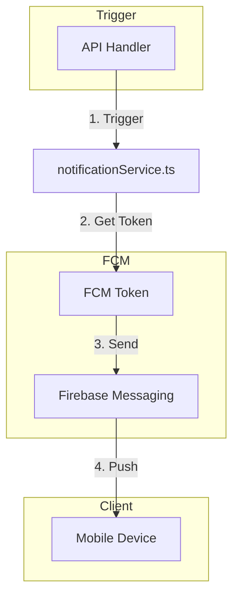

# Event Flows Analysis

## Current Event System

The system currently uses a simple request-response model with Firebase Cloud Messaging (FCM) for push notifications. There is no dedicated event bus or message queue implementation.

## Notification Flow (Current)



## Implemented Notification Triggers

| Event | Trigger Location | Notification To |
|-------|------------------|-----------------|
| New Booking Created | `backend_server/src/routes/bookings.ts` | Admin (all) |
| Job Assigned | `backend_server/src/routes/jobs.ts` | Assigned employee |
| Job Completed | `backend_server/src/routes/jobs.ts:complete` | Customer, Admin |
| Payment Received | `backend_server/src/routes/razorpay.ts` | Customer |
| Payment Failed | `backend_server/src/routes/razorpay.ts` | Customer |

## Notification Implementation

```typescript
// From backend_server/src/services/notificationService.ts
export async function sendPushNotification({
  tokens,
  title,
  body,
  data
}: {
  tokens: string[]
  title: string
  body: string
  data: Record<string, string>
}) {
  const messaging = getMessaging()
  await messaging.sendEachForMulticast({
    tokens,
    notification: { title, body },
    data
  })
}
```

## Missing Event Patterns

### 1. Real-time Updates (Not Implemented)
- Firestore listeners not used in mobile apps
- Polling instead of push for job status updates

### 2. Background Jobs (Not Implemented)
- No task queue for async processing
- No scheduled jobs (e.g., reminder notifications)

### 3. Webhooks (Not Implemented)
- No webhook infrastructure for external events
- Payment webhooks not fully implemented

### 4. Pub/Sub (Not Implemented)
- No message queue for inter-service communication
- Direct calls instead of event-driven

## Event Opportunities

### 1. Firestore Triggers (Cloud Functions)

```typescript
// Potential Cloud Functions
exports.onJobCreated = functions.firestore
  .document('jobs/{jobId}')
  .onCreate((snap, context) => {
    // Send notification to employees
    // Update analytics
    // etc.
  })

exports.onJobCompleted = functions.firestore
  .document('jobs/{jobId}')
  .onUpdate((change, context) => {
    // Generate invoice
    // Update customer stats
    // Trigger follow-up actions
  })
```

### 2. Scheduled Jobs

```typescript
// Potential scheduled functions
exports.dailyReminder = functions.pubsub
  .schedule('0 9 * * *')
  .onRun((context) => {
    // Send reminder for scheduled visits
  })
```

### 3. Event Bus (Future)

```typescript
// Potential event-driven architecture
class EventBus {
  publish(event: Event): void
  subscribe(handler: EventHandler): void
}
```

## Firebase Triggers Available

| Trigger | Status | Implementation |
|---------|--------|----------------|
| onCreate | Not used | Would trigger on new bookings/jobs |
| onUpdate | Not used | Would trigger on status changes |
| onDelete | Not used | Could trigger cleanup |
| onWrite | Not used | Comprehensive trigger |

## Confidence Level

**Medium** - Notification flow verified, but event system opportunities not fully explored in codebase.