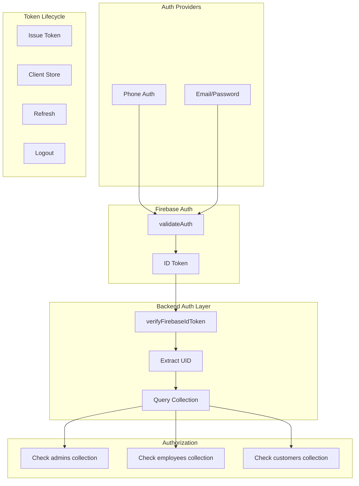
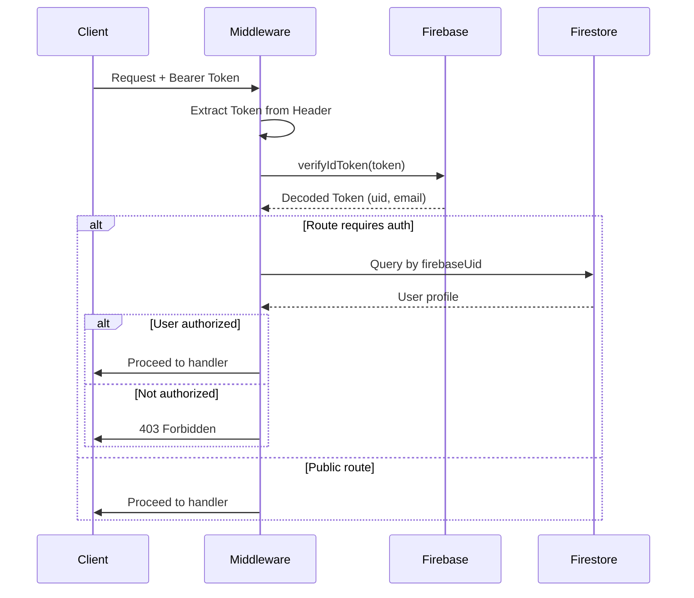
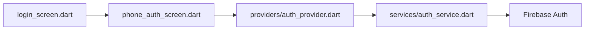
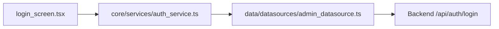

# Authentication & Authorization Flow

## Authentication Architecture

The system uses **Firebase Authentication** as the primary identity provider, with backend authorization checks against Firestore collections.



## Token Lifecycle

1. **Login**: Client authenticates with Firebase → receives ID Token
2. **Storage**: Client stores token (SecureStorage/Memory)
3. **API Calls**: Client includes `Authorization: Bearer <token>` in requests
4. **Validation**: Backend verifies token with Firebase Admin SDK
5. **Authorization**: Backend checks Firestore for role
6. **Refresh**: Token auto-refreshed by Firebase SDK before expiry
7. **Logout**: Client discards token (server-side invalidation not implemented)

## Role-Based Access Control (RBAC)

| Role | Collections | Access Level |
|------|-------------|--------------|
| `admin` | `admins` | Full access to all API endpoints |
| `employee` | `employees` | Job operations, earnings, profile |
| `customer` | `customers` | Own bookings, services, payments |

### Backend Role Check Implementation

```typescript
// From backend_server/src/routes/auth.ts
const adminUsers = await queryCollection('admins', [
  { field: 'firebaseUid', operator: '==', value: uid }
])
// If admin found, return user with role
```

## Auth Middleware Flow



## Mobile App Auth Implementation

### Customer App (`mobile_customer/lib/features/auth/`)



**Key Files**:
- `lib/features/auth/screens/login_screen.dart` - Entry point
- `lib/features/auth/screens/phone_auth_screen.dart` - Phone verification
- `lib/features/auth/providers/auth_provider.dart` - State management
- `lib/features/auth/services/auth_service.dart` - Firebase interaction

### Employee App (`mobile_employee/lib/features/auth/`)

Similar pattern:
- `lib/features/auth/login_screen.dart`
- `lib/features/auth/splash_screen.dart`
- `lib/features/auth/services/auth_service.dart`

## Admin Web Auth Implementation



**Key Files**:
- `src/features/auth/login_screen.tsx`
- `src/core/services/auth_service.ts`
- `src/data/datasources/admin_datasource.ts`

## Security Considerations

### Current Implementation (Secure)
1. Firebase ID token verification (industry standard)
2. Token not stored in plain text (assumed secure storage)
3. HTTPS-only communication
4. CORS origin validation

### Potential Vulnerabilities (Review Needed)
1. **No server-side token invalidation** - Logout only discards client-side
2. **No token rotation** - Long-lived tokens not rotated
3. **No rate limiting** - Brute force possible
4. **Role stored in Firestore** - Can be tampered if security rules weak

## Token Storage Analysis

### Mobile Apps
- **Flutter**: Uses `flutter_secure_storage` or similar
- Assumed: Tokens stored in secure enclave

### Admin Web
- **React**: In-memory or localStorage (needs verification)
- Risk: XSS could expose token

## Confidence Level

**High** - Auth flow verified through code inspection of all auth-related files across all three applications.