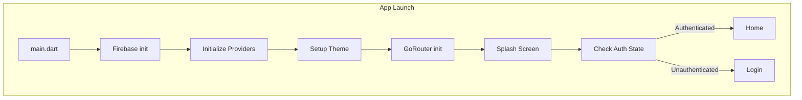
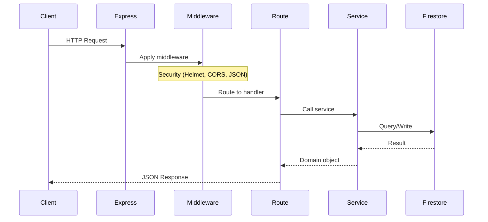
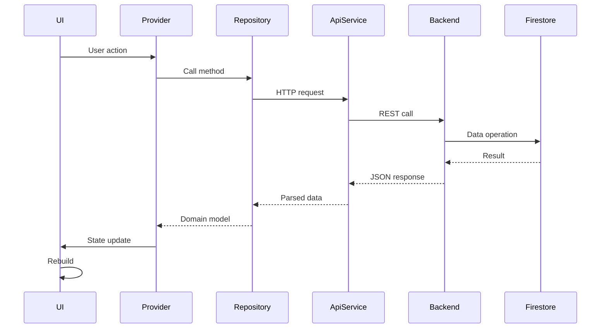
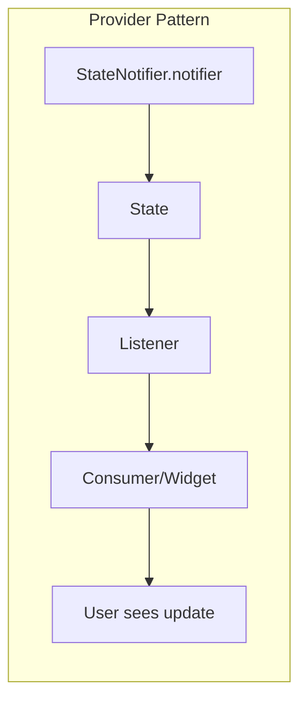
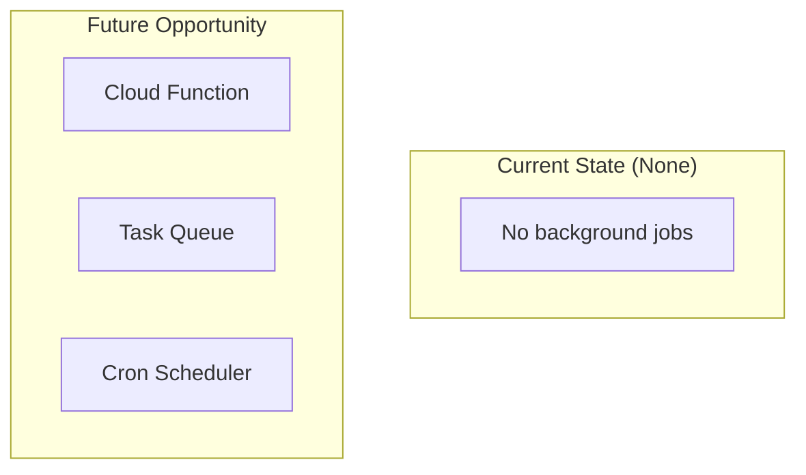

# Runtime Execution Flow

## 1. Backend Server Startup

```mermaid
flowchart TB
    subgraph "Startup Sequence"
        Start[server.ts main] --> Init[initialize Firebase]
        Init --> Create[createApp()]
        Create --> Middleware[Register middleware]
        Middleware --> Routes[Register routes]
        Routes --> Listen[Start HTTP server]
        Listen --> Ready[Server ready]
    end
```

**From** `backend_server/src/server.ts`:
```typescript
const app = createApp()
const port = process.env.PORT || 3000
app.listen(port, () => { ... })
```

**From** `backend_server/src/app.ts`:
```typescript
export function createApp() {
  const app = express()
  // Security middleware
  app.use(helmet())
  app.use(cors(...))
  app.use(express.json(...))
  app.use(morgan('dev'))

  // Route registration
  app.use('/api/auth', authRouter)
  app.use('/api/jobs', verifyFirebaseIdToken, jobsRouter)
  // ... more routes

  return app
}
```

## 2. Customer App Startup



**From** `mobile_customer/lib/main.dart`:
```dart
void main() async {
  WidgetsFlutterBinding.ensureInitialized();
  await Firebase.initializeApp();
  runApp(ProviderScope(child: SafeComApp()));
}
```

## 3. Request Handling Flow



## 4. Mobile App API Call Flow



## 5. State Update Propagation



## 6. Background Job Flow



## Execution Patterns Identified

| Pattern | Location | Implementation |
|---------|----------|----------------|
| Express middleware chain | `app.ts` | Sequential |
| Route handlers | `routes/*.ts` | Request-response |
| StateNotifiers | `lib/features/*/providers/` | Riverpod |
| Firestore snapshots | Not used | Could add |
| Cloud Functions | Not used | Could add |

## Confidence Level

**High** - Verified through code inspection of initialization and request handling code.