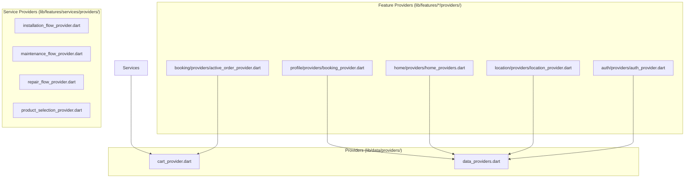
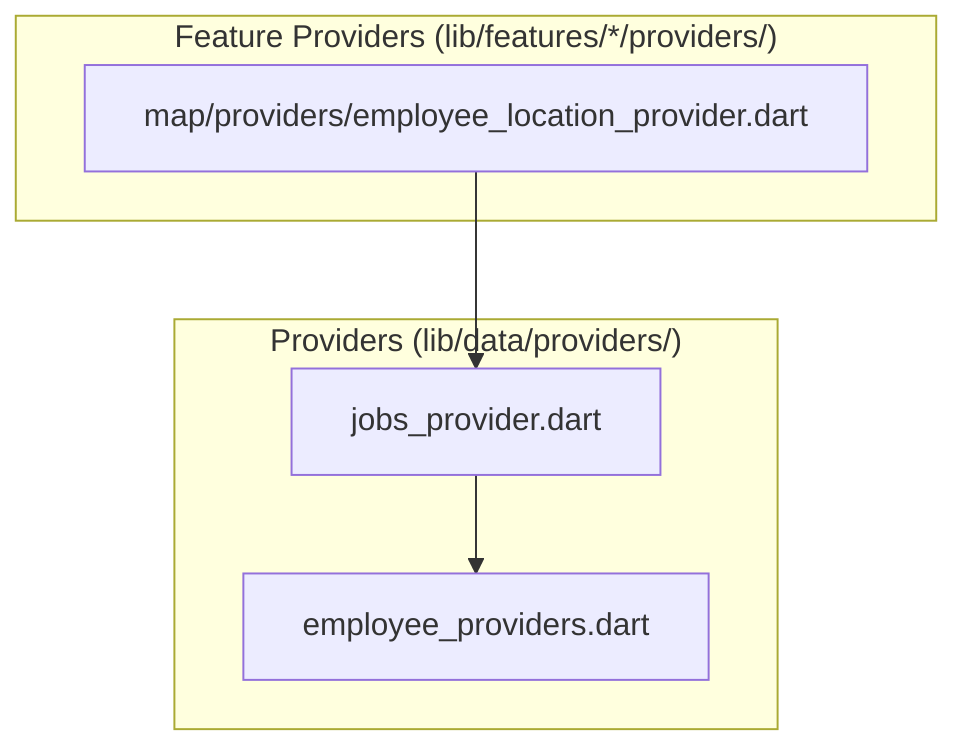
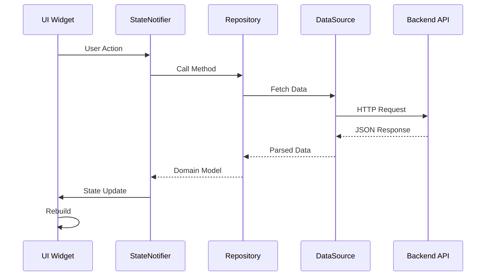
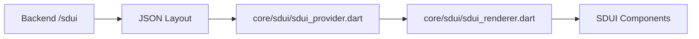

# State Management Architecture

## Overview

Both mobile apps use **Riverpod** (Flutter's recommended state management solution) with a provider-based architecture.

## Customer App State Management

### Provider Structure



### Key Providers

| Provider | Purpose | Location |
|----------|---------|----------|
| `AuthProvider` | Authentication state, user session | `lib/features/auth/providers/auth_provider.dart` |
| `CartProvider` | Shopping cart for services | `lib/data/providers/cart_provider.dart` |
| `LocationProvider` | User location state | `lib/features/location/providers/location_provider.dart` |
| `BookingFlowProvider` | Booking wizard state | `lib/features/booking/providers/booking_flow_provider.dart` |
| `ActiveOrderProvider` | Current active order tracking | `lib/features/booking/providers/active_order_provider.dart` |
| `InstallationFlowProvider` | Installation service flow | `lib/features/services/providers/installation_flow_provider.dart` |
| `MaintenanceFlowProvider` | Maintenance service flow | `lib/features/services/providers/maintenance_flow_provider.dart` |
| `RepairFlowProvider` | Repair service flow | `lib/features/services/providers/repair_flow_provider.dart` |
| `HomeProviders` | Home screen data | `lib/features/home/providers/home_providers.dart` |

### Provider Implementation Pattern

```dart
// Example: AuthProvider
class AuthProvider extends StateNotifier<AuthState> {
  final AuthService _authService;

  AuthProvider(this._authService) : super(AuthState.initial());

  Future<void> signInWithPhone(String phone) async {
    state = state.copyWith(isLoading: true);
    try {
      final user = await _authService.signIn(phone);
      state = state.copyWith(user: user, isAuthenticated: true);
    } catch (e) {
      state = state.copyWith(error: e.toString());
    }
  }
}
```

## Employee App State Management

### Provider Structure



### Key Providers

| Provider | Purpose | Location |
|----------|---------|----------|
| `JobsProvider` | Job list state, filtering | `lib/data/providers/jobs_provider.dart` |
| `JobsProviders` | Jobs data management | `lib/data/providers/jobs_providers.dart` |
| `EmployeeProviders` | Employee profile state | `lib/data/providers/employee_providers.dart` |
| `EmployeeLocationProvider` | Location tracking | `lib/features/map/providers/employee_location_provider.dart` |

## Data Flow Pattern



## SDUI State (Server-Driven UI)

The customer app supports dynamic UI rendering via SDUI:



**Files**:
- `lib/core/sdui/sdui_provider.dart` - Provides layout data
- `lib/core/sdui/sdui_renderer.dart` - Renders components
- `lib/core/sdui/sdui_builders.dart` - Component builders
- `lib/core/sdui/sdui_models.dart` - Data models
- `lib/core/sdui/sdui_component_registry.dart` - Component mapping

## Admin Web State Management

The Admin web app uses React's built-in state management:

- **useState**: Local component state
- **useReducer**: Complex state (in hooks)
- **Context**: Shared auth state
- **React Query**: Server state caching (if used - needs verification)

**Files**:
- `src/core/hooks/useAuthenticatedData.ts` - Auth hook
- `src/core/services/auth_service.ts` - Auth logic

## State Persistence

| App | Storage | Purpose |
|-----|---------|---------|
| Customer | SecureStorage | Auth tokens |
| Customer | In-memory | Cart, active booking |
| Employee | SecureStorage | Auth tokens |
| Employee | In-memory | Job cache |
| Admin | Memory/LocalStorage | Auth token |

## Confidence Level

**High** - Verified through code inspection of all provider files in both mobile apps.