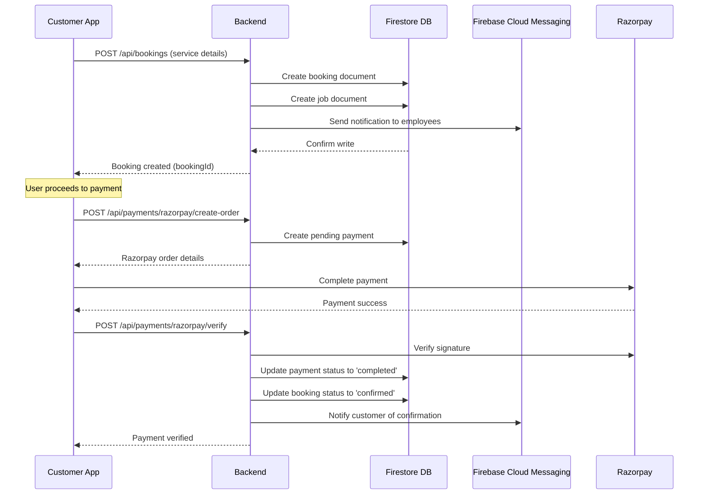
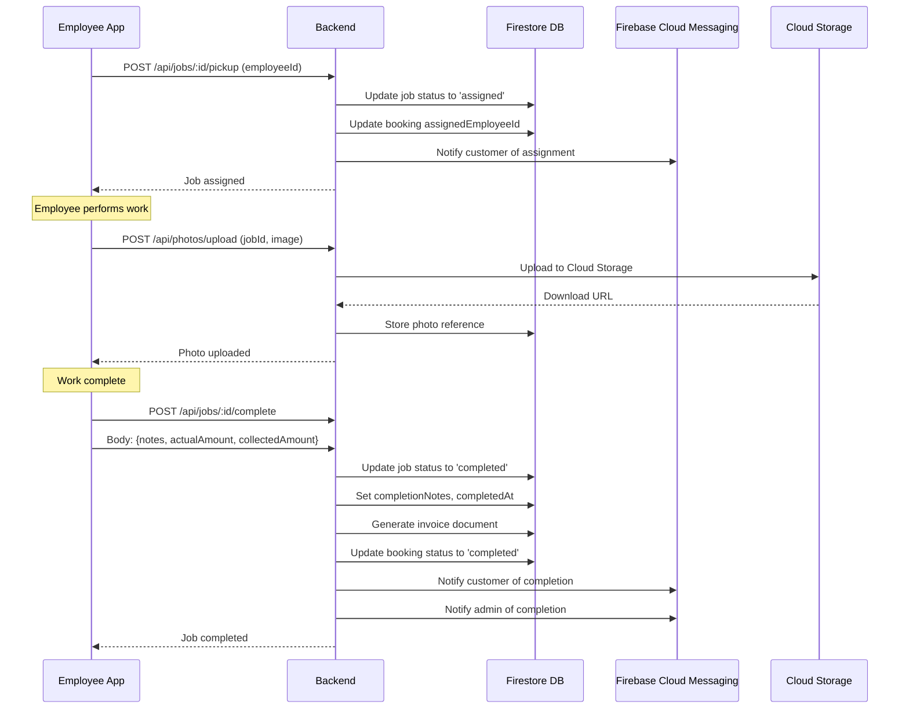
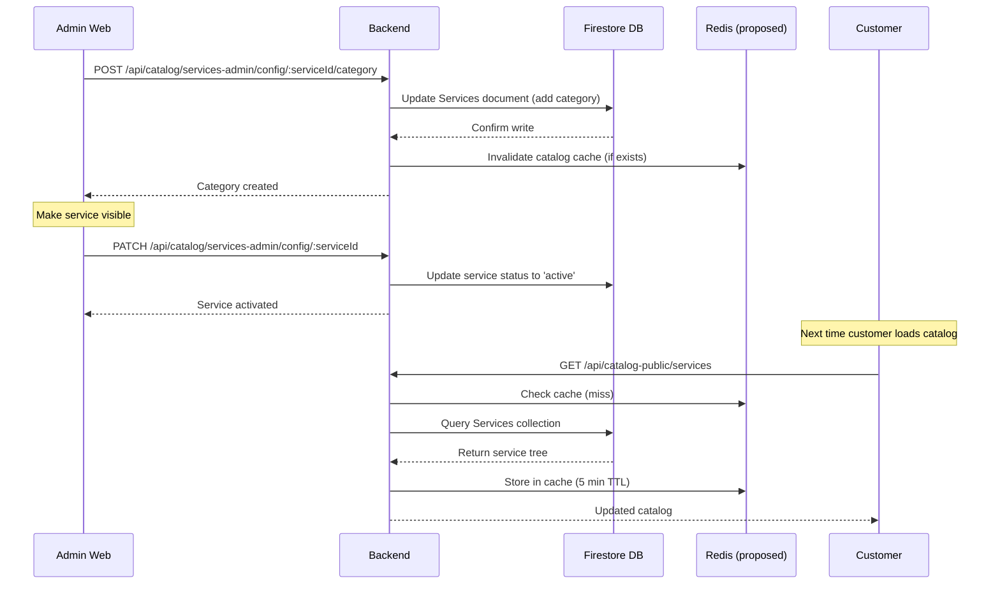
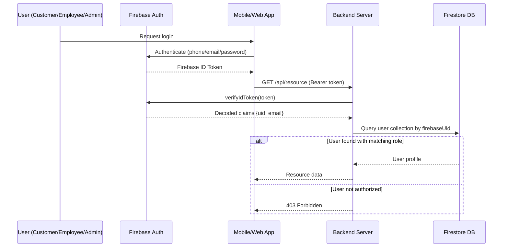

# Sequence Diagrams

## 1. Customer Booking Flow

## 2. Employee Job Completion Flow

## 3. Admin Service Catalog Update

## 4. Authentication Flow

## Confidence Level

**High** - Sequence diagrams based on verified API endpoint implementations and data flow patterns.