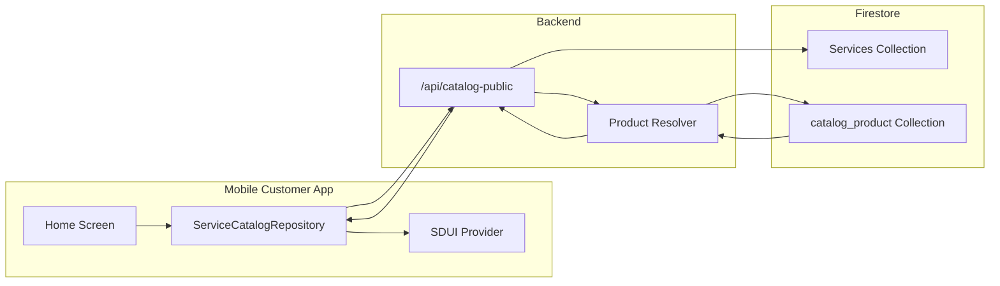
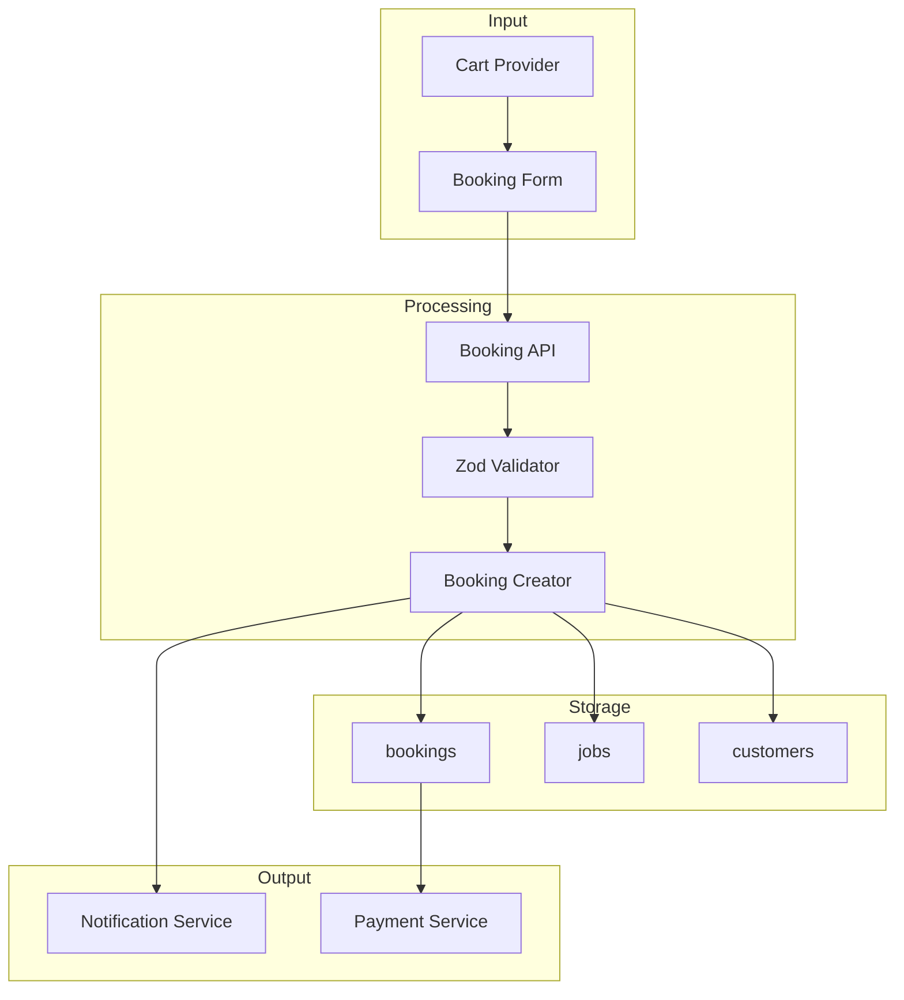
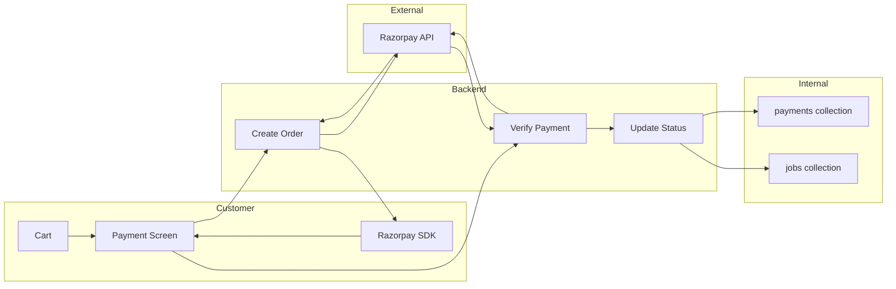
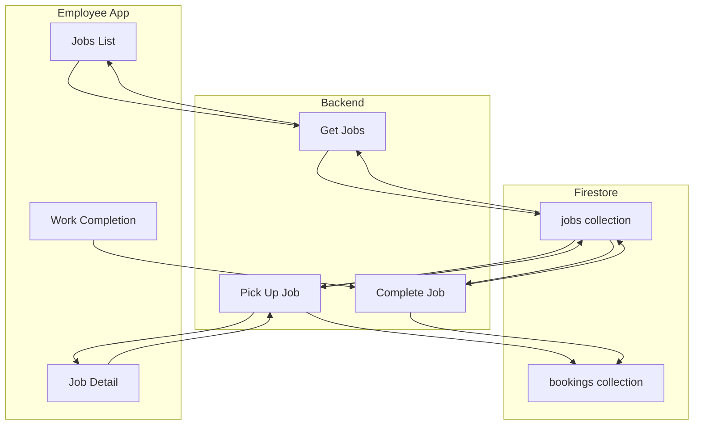
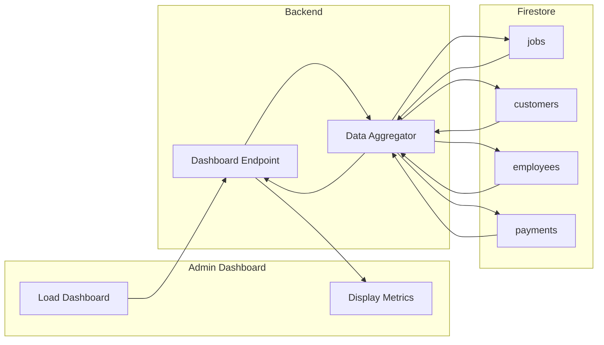

# Data Flow Diagrams

## 1. Service Discovery Data Flow

## 2. Booking Data Flow

## 3. Payment Data Flow

## 4. Employee Job Data Flow

## 5. Admin Analytics Data Flow

## Data Transformation Points

| Flow | Transform | Location |
|------|-----------|----------|
| Service Discovery | Firestore refs → Product objects | `backend_server/src/services/catalogService.ts` |
| Booking Creation | Input DTO → Firestore doc | `backend_server/src/routes/bookings.ts` |
| Job Completion | Input → Job + Invoice | `backend_server/src/routes/jobs.ts:complete` |
| Payment Verification | Razorpay response → DB update | `backend_server/src/routes/razorpay.ts` |

## Confidence Level

**High** - Data flows verified through code inspection of repositories, services, and API endpoints.