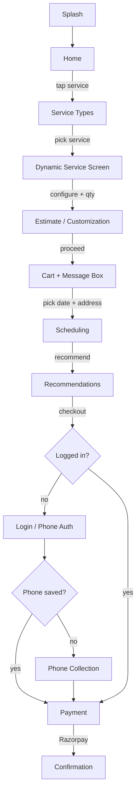
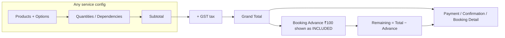
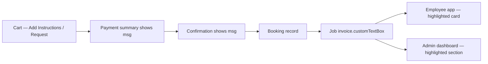
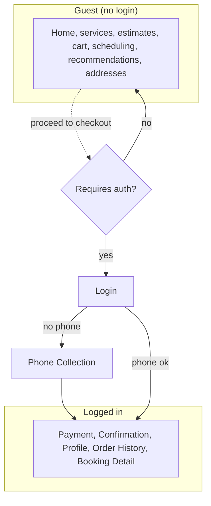

# 1 — Customer App UI/UX

> Flutter 1.3.9+38 · Android · guest-first browsing · warm amber light theme

## 1. Screen Inventory (current — verified 2026-08-09)

| # | Screen | File | Purpose | Auth |
|---|--------|------|---------|------|
| 1 | Splash | `features/splash/splash_screen.dart` | Brand splash, bootstrap | — |
| 2 | Login | `features/auth/screens/login_screen.dart` | Sign in / continue as guest | — |
| 3 | Phone Auth | `features/auth/screens/phone_auth_screen.dart` | OTP verification | — |
| 4 | Phone Collection | `features/auth/screens/phone_collection_screen.dart` | Capture phone (email optional) | Login |
| 5 | Location Permission | `features/location/location_permission_screen.dart` | GPS permission onboarding | — |
| 6 | Home | `features/home/home_screen.dart` | SDUI-driven landing (banners, services, location header) | — |
| 7 | Products Discovery | `features/services/products_discovery_screen.dart` | Browse products, add to cart | — |
| 8 | Service Types | `features/services/service_type_screen.dart` | Service category grid | — |
| 9 | Dynamic Service | `features/services/dynamic_service_screen.dart` | Renders any service tree (options, branches, clubs, qty engine) | — |
| 10 | Package Selection | `features/services/package_selection_screen.dart` | Installation package pick | — |
| 11 | Installation Customization | `features/invoice/installation_customization_screen.dart` | Configure install (nested products/options) | — |
| 12 | Maintenance Types | `features/services/maintenance_type_screen.dart` | Maintenance variants | — |
| 13 | Maintenance Package | `features/services/maintenance_package_screen.dart` | Plan pick | — |
| 14 | Maintenance Customization | `features/invoice/maintenance_customization_screen.dart` | Configure maintenance | — |
| 15 | AMC Plans | `features/services/amc_plan_screen.dart` | Annual Maintenance Contract plans | — |
| 16 | Repair Issues | `features/services/repair_issue_screen.dart` | Symptom picker | — |
| 17 | Repair Estimate | `features/invoice/repair_estimate_screen.dart` | Live estimate | — |
| 18 | System Upgrade | `features/services/system_upgrade_screen.dart` | Upgrade bundles | — |
| 19 | Upgrade Estimate | `features/invoice/upgrade_estimate_screen.dart` | Live estimate | — |
| 20 | Accessories | `features/services/accessories_screen.dart` | Accessory catalog | — |
| 21 | Accessories Estimate | `features/invoice/accessories_estimate_screen.dart` | Live estimate | — |
| 22 | Cart (sheet) | `features/cart/screens/cart_screen.dart` | Cart + universal message box | — |
| 23 | Scheduling | `features/booking/scheduling_screen.dart` | Date/time + address | — |
| 24 | Recommendation | `features/booking/recommendation_screen.dart` | Cross-sell add-ons | — |
| 25 | Payment | `features/booking/payment_screen.dart` | Razorpay checkout + summary | **Login+phone** |
| 26 | Confirmation | `features/booking/booking_confirmation_screen.dart` | Post-payment receipt | **Login+phone** |
| 27 | Profile | `features/profile/screens/profile_screen.dart` | Account + saved data | **Login+phone** |
| 28 | Order History | `features/profile/screens/order_history_screen.dart` | Past bookings | **Login+phone** |
| 29 | Booking Detail | `features/profile/screens/booking_detail_screen.dart` | Invoice math + message | **Login+phone** |
| 30 | Address List | `features/profile/screens/address_list_screen.dart` | Saved addresses | — |
| 31 | Address Form | `features/profile/screens/address_form_screen.dart` | Add/edit address + map picker | — |
| 32 | About | `features/info/about_screen.dart` | Company info, contacts | — |

## 2. Primary User Flows

### 2.1 Guest browsing → booking → payment

### 2.2 Estimate → invoice math (consistent everywhere)

### 2.3 Message box propagation

## 3. Navigation & Guards

- Only **5 routes** require auth: `/payment`, `/confirmation`, `/profile`,
  `/order-history`, `/booking-detail`.
- Logged-in users with a missing phone are redirected to
  `/phone-collection?continue=<original route>` (email optional).
- Logged-in users are bounced off `/login` and `/phone-auth` to `/home`.

## 4. UI/UX Patterns

- **Cards & sheets**: services, products, and options render as tappable cards
  with quantity steppers (`quantity_stepper.dart`), clubbed-product selectors
  (`clubbed_product_selector.dart`), and nested selection popups
  (`nested_selection_popup.dart`).
- **Money clarity**: GST-inclusive prices; "booking advance (included)" line on
  every total; remaining amount = total − advance (clamped ≥ 0).
- **Loading states**: skeleton/shimmer on data screens; progress states during
  Razorpay flow.
- **Branding**: SafeCom logo widget on login/phone-auth/phone-collection/location/about.
- **Internal keys never leak**: display names used in selectors (fixed 2026-08-09).
- **Privacy**: Android auto-backup disabled — uninstall clears all user data.

## 5. Bottom Navigation & Home

The home screen is **SDUI-driven**: a location header
(`widgets/location_header.dart`), promo banner (respects `hideWhenServiceable`),
horizontal scroll lists (`horizontal_scroll_list.dart`), and a service grid
(`service_grid.dart`), all fed by backend layout config. Fallback content exists
in `features/home/fallback_home_content.dart`.

---

*Verified against `mobile_customer/lib` @ 2026-08-09.*
