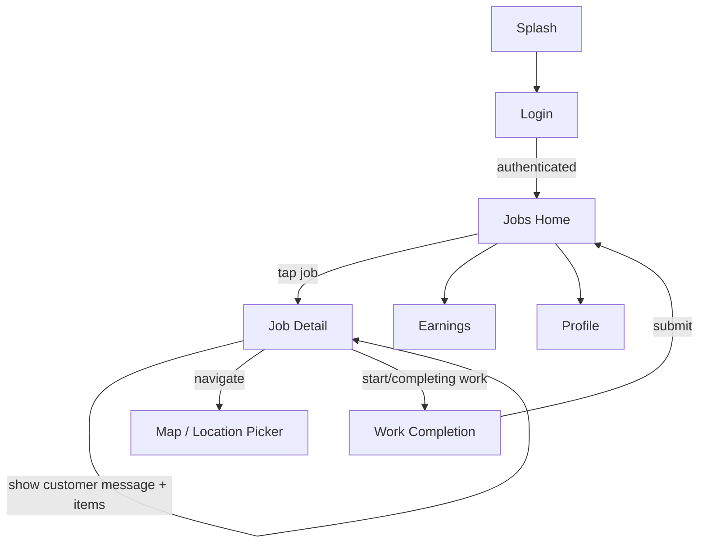
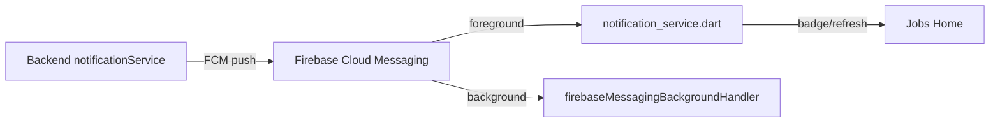

# 2 — Employee App UI/UX

> Flutter 1.1.3+29 · Android · light/dark themes · FCM notifications

## 1. Screen Inventory (current — verified 2026-08-09)

| # | Screen | File | Purpose |
|---|--------|------|---------|
| 1 | Splash | `features/auth/splash_screen.dart` | Brand splash, auth bootstrap |
| 2 | Login | `features/auth/login_screen.dart` | Sign in with employee credentials |
| 3 | Jobs Home | `features/jobs/jobs_home_screen.dart` | Job board: assigned jobs, filters, status chips, pull-to-refresh |
| 4 | Job Detail | `features/jobs/job_detail_screen.dart` | Job info, customer message card, map link, actions |
| 5 | Work Completion | `features/jobs/work_completion_screen.dart` | Complete work: notes, outcomes |
| 6 | Map | `features/map/map_screen.dart` | Job locations, live location |
| 7 | Location Picker | `features/map/location_picker_screen.dart` | Pick/confirm coordinates |
| 8 | Earnings | `features/earnings/earnings_screen.dart` | Earnings dashboard |
| 9 | Profile | `features/profile/employee_profile_screen.dart` | Employee profile, logout |

> ⚠️ **Removed (2026-07)**: photo capture (`photo_capture_screen.dart`) and photo
> gallery (`photo_gallery_screen.dart`) — the camera feature was dropped.

## 2. Primary User Flows

### 2.1 Job lifecycle

### 2.2 Notifications

- `FirebaseMessaging.onBackgroundMessage` registered in `main.dart`.
- `NotificationService.initialize()` handles permission + token registration
  (`POST /api/employees/device-token`).
- New job / job-update pushes keep the board current.

## 3. UI/UX Patterns

- **Job cards**: status badges (pending / assigned / in_progress / completed),
  customer + address + scheduled time, earnings hint.
- **Customer message**: highlighted "Customer's Message / Instruction" card on
  job detail (`invoice.customTextBox`, with fallback to text-box line items).
- **Dark mode**: `theme_provider.dart` (`themeModeProvider`) — user-selectable
  light/dark; `AppTheme.light` / `AppTheme.dark` in `core/theme/app_theme.dart`.
- **Map**: `map_screen.dart` supports a single job, a job list, or standalone
  mode; live location via `employee_location_provider.dart` +
  `core/services/location_service.dart`.
- **Earnings**: `earnings_screen.dart` aggregates via `earnings_datasource.dart`
  (total revenue in actual rupees — not truncated lakhs, fixed 2026-06).
- **Privacy**: Android auto-backup disabled (`allowBackup=false`, guard-tested)
  so logout/uninstall clears data including tokens.

## 4. Design Tokens (employee app)

| Token | Value | Usage |
|-------|-------|-------|
| `primary` | `#D4760A` warm amber | CTAs, active states, accents |
| `primaryLight` | `#FFF3E0` | Selection backgrounds |
| `background` | `#F5F2ED` warm stone | Screen background |
| `surface` | `#FFFFFF` | Cards |
| `error/success` | `#C62828` / `#2E7D32` | Status, payments |

---

*Verified against `mobile_employee/lib` @ 2026-08-09.*
