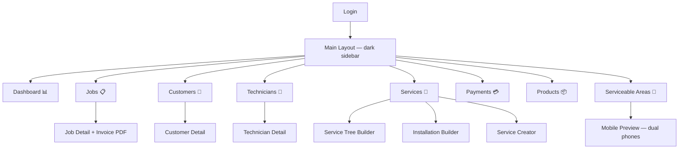
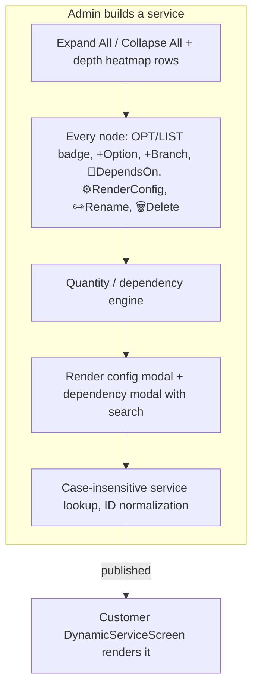
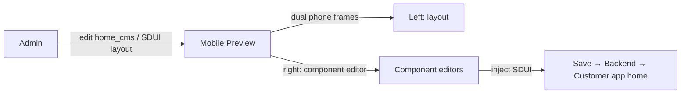
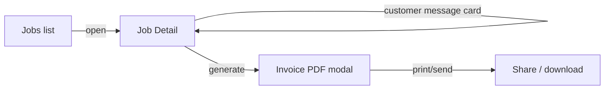

# 3 — Admin Web App UI/UX

> React + Vite + TypeScript · Firebase Hosting · dark command-center aesthetic

## 1. Screen Inventory (current — verified 2026-08-09)

| # | Module / Screen | File | Purpose |
|---|-----------------|------|---------|
| 1 | Login | `features/auth/login_screen.tsx` | Admin sign-in |
| 2 | Dashboard | `features/dashboard/dashboard_screen.tsx` | KPIs, auto-refresh polling, revenue in ₹ |
| 3 | Jobs | `features/jobs/jobs_screen.tsx` | Job list + filters |
| 4 | Job Detail | `features/jobs/job_detail_screen.tsx` | Job info, customer message, invoice PDF modal |
| 5 | Customers | `features/customers/customers_screen.tsx` | Customer list/detail |
| 6 | Technicians | `features/technicians/technicians_screen.tsx` | Technician CRUD + passwords |
| 7 | Catalog — Products | `features/catalog/catalog_screen.tsx` | Product catalog |
| 8 | Catalog — Service Tree Builder | `features/catalog/service_tree_builder_screen.tsx` | OPT/LIST badges, dependencies, render config, expand/collapse, heatmap rows |
| 9 | Catalog — Installation Builder | `features/catalog/installation_builder.css/.tsx` | Installation tree editor |
| 10 | Catalog — Service Creator | `features/catalog/service_creator_screen.tsx` | Create services (ID normalization) |
| 11 | Payments | `features/payments/payments_screen.tsx` | Payment records |
| 12 | Serviceable Areas | `features/settings/serviceable_areas_screen.tsx` | Area/pincode registry (shared with SDUI) |
| 13 | Mobile Preview | `features/mobile_preview/mobile_preview_screen.tsx` | Dual-phone frames + SDUI/CMS injection |
| 14 | Styles | `features/styles/` | Style/form editors |

## 2. Navigation Structure

Sidebar sections (`widgets/common/main_layout.tsx`): Dashboard, Jobs, Customers,
Technicians, Services (dynamic tree), Payments, Products, Serviceable Areas,
Mobile Preview — each with emoji icons and active-state highlighting.

## 3. Key Interaction Patterns

### 3.1 Service Tree Builder (flagship)

- OPT = options, LIST = list mode; badge-group per row.
- Dependency engine auto-maps product quantities (🔗 dependency badge).
- All action buttons exist at **every** product level.
- Transaction-based deletes handle categories with special characters; renames
  with dots are safe (no more 500s).

### 3.2 Mobile Preview / CMS

### 3.3 Jobs + Invoice PDF

## 4. UI/UX Patterns

- **Design system**: unified CSS variables in `index.css` (~1,270 lines) — dark
  command-center sidebar (charcoal/amber), grain texture, warm stone content
  area, staggered animations, no purple/indigo palette.
- **Typography**: Outfit / Plus Jakarta Sans.
- **Polling**: dashboard auto-refreshes (rewritten without the broken custom
  hook — React #310 fixed); `useCounter` hook for animated counters.
- **Validation**: TypeScript `tsc` enforced in CI; admin datasource unwraps the
  `{success, data}` envelope (`admin_datasource.ts`).

---

*Verified against `Admin/web_app/admin-dashboard/src` @ 2026-08-09.*
