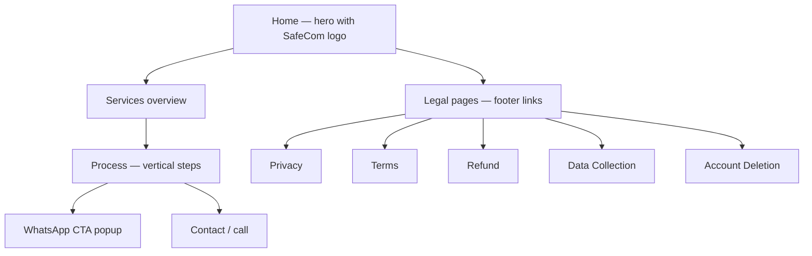

# 4 — Customer Landing (Marketing + Legal) UI/UX

> Static HTML/CSS · Firebase Hosting · light editorial theme

## 1. Pages

| Page | File | Purpose |
|------|------|---------|
| Home (landing) | `customer_landing/index.html` | Marketing: hero, services, process, WhatsApp CTA, contact |
| Privacy Policy | `customer_landing/privacy-policy.html` | Play Store compliance |
| Terms of Service | `customer_landing/terms-of-service.html` | Play Store compliance |
| Refund Policy | `customer_landing/refund-policy.html` | Play Store compliance |
| Data Collection | `customer_landing/data-collection.html` | Play Store compliance |
| Account Deletion | `customer_landing/account-deletion.html` | Play Store compliance |
| Contact | `customer_landing/contact.html` | Contact form/links |

## 2. Design Evolution (2026-05)

1. **Initial**: shield-emoji hero.
2. **Redesign 1**: light editorial theme, WhatsApp popup, proper alignment/spacing,
   corrected developer email.
3. **Redesign 2**: mobile-first — hamburger nav, vertical process flow, stacked
   cards, optimized touch targets, WhatsApp CTA.
4. **Final**: SafeCom logo (visual + small topbar variant for loading speed),
   unified branding across all pages.

## 3. Landing Flow

## 4. UI/UX Notes

- Mobile-first with touch-target sizing; single-column stack on small screens.
- WhatsApp deep-link CTA (wa.me) as the primary conversion path.
- Consistent SafeCom logo and brand colors across marketing and legal pages.
- Legal pages exist to satisfy Play Store compliance requirements.

---

*Verified against `customer_landing/` @ 2026-08-09.*
