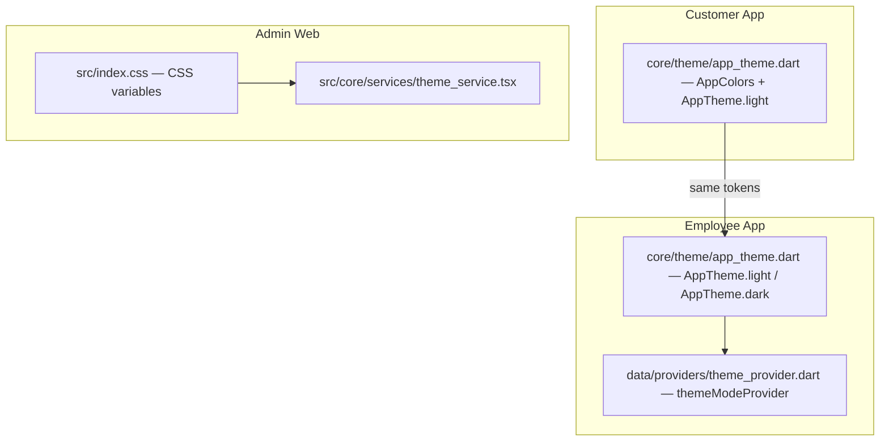

# 5 — Shared Design System

> Cross-app tokens for SafeCom (customer app, employee app, admin web, landing).

## 1. Brand Palette

The brand moved from dark navy/blue accents to a **warm amber + slate/ink**
identity during 2026-05-18 (commit `df72597` / `41f01e7`).

| Role | Token | Hex | Used for |
|------|-------|-----|----------|
| Background | `background` | `#F5F2ED` | Warm stone app background (mobile) |
| Surface | `surface` | `#FFFFFF` | Cards, sheets |
| Surface variant | `surfaceVariant` | `#EDE9E3` | Raised elements |
| Border | `border` | `#D4CDBF` | Hairlines, dividers |
| Primary (ink) | `primary` | `#0F172A` | Customer app primary/inks, headings |
| Accent (amber) | `secondary` / `primary` | `#D4760A` | CTAs, active states, highlights |
| Accent light | `secondaryLight` / `primaryLight` | `#FFF3E0` | Selection/notice backgrounds |
| Success | `success` | `#2E7D32` | Paid/completed states |
| Error | `error` | `#C62828` | Errors, failed states |
| Warning | `warning` | `#E65100` | Warnings |
| Accent (blue) | `accent` | `#1565C0` | Links, info (secondary use) |
| Text primary | `textPrimary` | `#1A1A1A` | Body |
| Text secondary | `textSecondary` | `#5C5C5C` | Supporting text |
| Text muted | `textMuted` | `#9E9E9E` | Placeholders, hints |
| Shadow | `shadow` | `0x1A000000` | Elevation |

> Customer app: ink `primary #0F172A` + amber `secondary #D4760A`.
> Employee app: amber `primary #D4760A` + dark-mode variants.
> Admin web: charcoal sidebar + amber accents (dark command-center).

## 2. Typography

| Surface | Fonts | Notes |
|---------|-------|-------|
| Customer/Employee apps | Flutter Material defaults (Roboto) | — |
| Admin web | **Outfit / Plus Jakarta Sans** | Staggered animations, grain texture |
| Landing | System stacks, mobile-first | — |

## 3. Theming Architecture

- **Customer app**: single light theme, `AppColors` constants.
- **Employee app**: light + dark via `themeModeProvider` (persisted).
- **Admin web**: CSS custom properties + `theme_service.tsx`; dashboard charts
  use `useCounter` for animated counters.

## 4. Shared Components

| Component | Where | Notes |
|-----------|-------|-------|
| SafeCom logo | `mobile_customer/lib/core/widgets/safecom_logo.dart` + `customer_landing/images` | Login, phone auth, collection, location, about |
| Quantity stepper | `mobile_customer/lib/widgets/common/quantity_stepper.dart` | Product quantity controls |
| Clubbed product selector | `mobile_customer/lib/widgets/common/clubbed_product_selector.dart` | Groups of products |
| Nested selection popup | `mobile_customer/lib/widgets/common/nested_selection_popup.dart` | Branch/option pickers |
| List product group | `mobile_customer/lib/widgets/common/list_product_group_widget.dart` | LIST-mode rows |
| Customer bottom nav | `mobile_customer/lib/widgets/common/customer_bottom_navigation.dart` | Home/Bookings/Profile |
| Invoice table | `mobile_customer/lib/features/invoice/widgets/invoice_table.dart` | Consistent money math |

## 5. UX Conventions (shared)

- **Money**: GST-inclusive prices; booking advance always labeled "included";
  remaining = total − advance (clamped ≥ 0) — identical on payment, confirmation,
  and booking detail.
- **Feedback**: loading skeletons/shimmer, snackbars for add-to-cart, progress
  states during payment.
- **Privacy**: Android auto-backup disabled on both apps; uninstall clears data.
- **Internal names never leak**: selectors show display/product names, not
  builder keys (fixed 2026-08-09).

---

*Last updated: 2026-08-09.*
