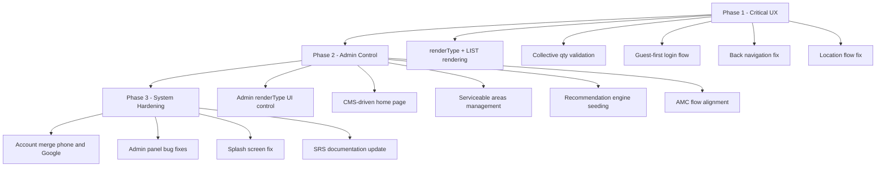

# SafeCom Platform Evolution Roadmap
*Session: 2026-05-14 | Status: Planning & Architecture*

---

> [!IMPORTANT]
> This document captures the full evolution specification for the SafeCom platform — from a "simple invoice app" to a **dynamic configurable commerce engine**. The database backbone already supports most of this; the work is in the **rendering layer, admin configurability, and UX state handling**.

---

## System Context

### Deployment Split (Canonical)

| App | Region | Base URL |
|-----|--------|----------|
| **Admin Dashboard** | `us-central1` | `https://safecom-backend-177425757120.us-central1.run.app/api` |
| **Customer Mobile** | `asia-south1` | `https://safecom-backend-177425757120.asia-south1.run.app/api` |
| **Employee Mobile** | `asia-south1` | `https://safecom-backend-177425757120.asia-south1.run.app/api` |

### Current Architecture Baseline

The system already has:
- ✅ Recursive nested product tree (`installationAdmin.ts` `extractTree()` function)
- ✅ Branch-based option hierarchy (leaf/branch detection via `isLeafNode()`)
- ✅ Min/max quantity support (`min q`, `max q`, `Deafult q` fields)
- ✅ Clubbed option groups (`club-existing` endpoint)
- ✅ Reusable catalog architecture (`catalog_product` collection)
- ✅ Separate backend deployments (us-central1 / asia-south1)
- ✅ Dynamic rendering capability (SDUI pattern in `sdui.ts`)

### What Is NOT Yet Done

- ❌ `renderType` field on nodes (OPTION vs LIST)
- ❌ Collective quantity validation across LIST siblings
- ❌ Guest-first authentication flow
- ❌ CMS-driven home page (currently hardcoded)
- ❌ AMC flow showing product configuration
- ❌ Admin recommendation seeding
- ❌ Serviceable area management (Patna hardcoded)
- ❌ Account merge logic (phone ↔ Google)
- ❌ Navigation state persistence (back button breaks flow)

---

## Phase 1 — Critical UX + Rendering Engine

> Target: Core experience that makes customer flow feel professional

### 1.1 NEW RenderType System (Critical)

Add a `renderType` field to every product node in the Firestore tree. This is a **backward-compatible additive change** — existing nodes without `renderType` default to `OPTION`.

#### A. `renderType = OPTION` (Current Default)

Classic popup selection. Supports:
- `selectionType: 'single'` — pick one from group
- `selectionType: 'multi'` — pick many from group

**Examples:** Hard disk size, NVR package, service tier

#### B. `renderType = LIST` (New)

Renders as a grouped block where each child has its own `[-] qty [+]` control. Validation is **collective** across siblings.

```
[ Camera Selection Block ]
─────────────────────────────────
Indoor Camera        [-]  2  [+]
Outdoor Camera       [-]  6  [+]
Audio Camera         [-]  0  [+]
─────────────────────────────────
Total Selected: 8 / 8  ✅
```

Rules:
- `sum(all child quantities) ≤ parent.maxQty`
- `sum(all child quantities) ≥ parent.minQty`
- Individual children still respect their own `minQty` / `maxQty`
- Admin sets `collectiveValidation: true` on the parent node

**Examples:** Camera selection, accessory kits, NVR channel packs

#### Schema Addition (Backward-Compatible)

```typescript
// Addition to existing ProductNode — no breaking changes
interface ProductNodeExtension {
  renderType?: 'option' | 'list';        // default: 'option'
  selectionType?: 'single' | 'multi';    // for renderType=option
  collectiveValidation?: boolean;         // for renderType=list
  minQty?: number;                        // already exists as 'min q'
  maxQty?: number;                        // already exists as 'max q'
  displayLabel?: string;                  // human-readable override for key name
  mandatory?: boolean;                    // default: true
}
```

> [!NOTE]
> The existing Firestore schema uses `min q`, `max q`, `Deafult q` as field names. The new fields (`renderType`, `collectiveValidation`, `displayLabel`, `mandatory`) are added alongside — no migration needed for existing data.

---

### 1.2 Nested LIST Support

A `LIST` node can contain:
- Products (leaf nodes)
- Branches (sub-groups)
- Another `LIST`

This enables structures like:

```
Camera Selection          [renderType=list, max=8, collectiveValidation]
 ├── Indoor               [renderType=list, sub-group]
 │    ├── 2MP             [product leaf, qty selector]
 │    └── 4MP             [product leaf, qty selector]
 └── Outdoor              [renderType=list, sub-group]
      ├── Audio           [product leaf, qty selector]
      └── Non-Audio       [product leaf, qty selector]
```

The `extractTree()` recursive function in `installationAdmin.ts` already supports this — it only needs to pass through `renderType` and `collectiveValidation` fields when serializing.

**Backend change needed:** In `extractTree()`, preserve `renderType` and `collectiveValidation` from the Firestore map when building `TreeNode`.

---

### 1.3 Quantity Validation Engine

New validation cascade (all levels must pass):

| Level | What Is Validated |
|-------|-------------------|
| **Leaf Product** | own `minQty` ≤ qty ≤ `maxQty` |
| **OPTION Group** | single: exactly 1 selected; multi: N selected |
| **LIST Group** | `sum(children.qty)` within parent `[minQty, maxQty]` |
| **Setup Total** | optional overall setup-level constraint |

This validation runs **client-side in real time** (Flutter) AND is **server-side verified** on order submission.

---

### 1.4 Login Flow — Guest First Architecture

**Current Problem:** App forces auth too early.

**New Flow:**
```
App Launch
→ Skip auth gate entirely
→ Browse categories, setups, products
→ Build full invoice / configure products
→ Schedule service
→ Review total
→ [Proceed to Payment]  ← Login required HERE ONLY
```

**Implementation Notes:**
- Remove auth guard from: home, service discovery, invoice builder, scheduling
- Keep auth guard on: payment, order confirmation, order history, profile
- Guest userId stored in local state; migrated to real UID on login

---

### 1.5 Location Flow Fix

**Current Problem:** App always opens location page on launch.

**New Behavior:**
```dart
// On app start:
final permission = await Geolocator.checkPermission();
if (permission == LocationPermission.granted || 
    permission == LocationPermission.whileInUse) {
  // silently fetch and cache location
  await _fetchLocationSilently();
} else {
  // continue normally — don't block
}
// Ask location only when user triggers a location-dependent action
```

---

### 1.6 Back Navigation Fix

All screens need:
- `WillPopScope` / `PopScope` handler (Android back button)
- Navigation stack preservation through service flow
- State not lost on back navigation (Riverpod `keepAlive` or cached providers)

---

## Phase 2 — Admin Configurability

### 2.1 Admin: RenderType Control on Nodes

The Installation Builder should let admin choose `renderType` per node:

```
[Camera Selection]  Type: [OPTION ▾]  →  toggle to  [LIST ▾]
                    Selection: [Multi]
                    Collective Total: [8]  Min: [8]  Max: [8]
```

**Backend endpoint needed:**
```
PATCH /api/catalog/installation-admin/category/:cat/setup/:setup/node/render-config
Body: { nodePath: string[], renderType: 'option'|'list', selectionType?: 'single'|'multi', collectiveValidation?: boolean }
```

---

### 2.2 CMS-Driven Home Page

Replace all hardcoded home page sections with Firestore-backed components.

**New Firestore collection: `home_cms`**

```typescript
interface HomeCmsBlock {
  id: string;
  type: 'banner' | 'promo' | 'update' | 'category_grid' | 'featured';
  order: number;           // admin-controlled sort order
  visible: boolean;        // show/hide toggle
  title?: string;
  subtitle?: string;
  imageUrl?: string;
  ctaLabel?: string;
  ctaRoute?: string;       // deep link route in app
  expiresAt?: Timestamp;   // auto-hide after date
}
```

**Admin UI:** New "Home CMS" section in sidebar with drag-to-reorder blocks.

---

### 2.3 Serviceable Area Management

Remove all hardcoding of "Patna". Replace with Firestore-backed config.

**New Firestore collection: `serviceable_areas`**

```typescript
interface ServiceableArea {
  id: string;
  city: string;
  state: string;
  pincodes?: string[];
  active: boolean;
  addedAt: Timestamp;
}
```

**Backend endpoints:**
```
GET  /api/serviceability/areas
POST /api/serviceability/areas        (admin only)
PATCH /api/serviceability/areas/:id   (admin only)
DELETE /api/serviceability/areas/:id  (admin only)
```

---

### 2.4 Recommendation Engine — Admin Seeding

Admins can attach recommendations to any setup or product.

**New Recommendation Schema:**

```typescript
interface RecommendationRule {
  id: string;
  triggerType: 'setup' | 'product' | 'service';
  triggerId: string;         // setup key or product id
  recommendations: {
    productId: string;
    label: string;            // e.g. "Recommended HDD Upgrade"
    reason?: string;          // e.g. "For 8+ camera setups"
    priority: number;
  }[];
  active: boolean;
}
```

Shown to customer after invoice is configured — cross-sell panel before checkout.

---

### 2.5 AMC Flow Alignment

AMC should mirror Installation flow, not skip straight to scheduling.

**New AMC Flow:**
```
AMC Service Selected
→ Show AMC coverage options (like setups)
→ Show included products/parts
→ Show recommendations
→ Build invoice
→ Schedule
→ Payment
```

---

## Phase 3 — System Hardening

### 3.1 Account Identity & Merge

**Primary identity:** `phone_number`  
**Secondary:** `google_email`

**Merge Rules:**
1. Google login → check if phone already registered → link same account
2. Phone OTP → check if Google account already linked → merge
3. Never create duplicate accounts for same phone

**Firestore `users` document extension:**
```typescript
interface UserIdentity {
  uid: string;               // Firebase Auth UID
  phone: string;             // primary — always required
  googleEmail?: string;      // optional secondary
  googleLinked: boolean;
  displayName: string;
  createdAt: Timestamp;
  lastLoginAt: Timestamp;
}
```

**Phone Required After Google Sign-In:**  
After Google login, if `phone` is null → show phone collection screen before proceeding.

---

### 3.2 Admin Panel Bug Fixes

Based on observed issues:

| Issue | Fix |
|-------|-----|
| Add Employee broken | Verify `POST /api/employees` endpoint + body schema |
| Mappings broken | Check Firestore ref resolution in `extractProductRef()` |
| Buttons non-functional | Audit action bindings in `InstallationBuilder.tsx` |
| Permission errors | Verify JWT role claim in `requireRole(['admin'])` middleware |

---

### 3.3 Splash Screen Fix

- Remove white background box
- Use transparent asset (`logo_transparent.png` if available)
- Respect safe area on notched devices
- Flutter: set `android:windowBackground` to brand color not white

---

## Backend Contract Reference

### Installation Admin Routes (us-central1)

```
GET    /api/catalog/installation-admin              → full recursive tree
POST   /api/catalog/installation-admin/category     → add category
DELETE /api/catalog/installation-admin/category/:key
POST   /api/catalog/installation-admin/category/:cat/setup
DELETE /api/catalog/installation-admin/category/:cat/setup/:setup
POST   /api/catalog/installation-admin/category/:cat/setup/:setup/product
DELETE /api/catalog/installation-admin/category/:cat/setup/:setup/product/:key
POST   /api/catalog/installation-admin/category/:cat/setup/:setup/node
DELETE /api/catalog/installation-admin/category/:cat/setup/:setup/node?path=[]
PATCH  /api/catalog/installation-admin/category/:cat/setup/:setup/node/quantities
PATCH  /api/catalog/installation-admin/category/:cat/setup/:setup/node/dynamic-field
POST   /api/catalog/installation-admin/category/:cat/setup/:setup/club-existing
PATCH  /api/catalog/installation-admin/products/:id/price
GET    /api/catalog/installation-admin/products?q=
```

**New endpoints to add:**
```
PATCH  /api/catalog/installation-admin/category/:cat/setup/:setup/node/render-config
GET    /api/serviceability/areas
POST   /api/serviceability/areas
PATCH  /api/serviceability/areas/:id
DELETE /api/serviceability/areas/:id
GET    /api/home-cms
PUT    /api/home-cms
PATCH  /api/home-cms/:blockId
```

---

## Priority Execution Order



---

## Key Files to Touch — Quick Reference

### Phase 1 Files

| File | Change |
|------|--------|
| `backend_server/src/routes/installationAdmin.ts` | Add `renderType`, `collectiveValidation` to `TreeNode`; preserve in `extractTree()` |
| `backend_server/src/routes/installationAdmin.ts` | Add `PATCH .../node/render-config` endpoint |
| `mobile_customer/lib/features/invoice/installation_customization_screen.dart` | Implement LIST render mode with collective qty validation |
| `mobile_customer/lib/features/auth/*` | Remove auth gate from non-payment screens |
| `mobile_customer/lib/features/location/*` | Make location permission non-blocking |
| `mobile_customer/lib/routes/*` | Add navigation stack preservation |

### Phase 2 Files

| File | Change |
|------|--------|
| `backend_server/src/routes/serviceability.ts` | Add CRUD for serviceable areas |
| `backend_server/src/routes/` | Add `homeCms.ts` route file |
| `mobile_customer/lib/features/home/*` | Consume CMS from API instead of hardcoded |
| `mobile_customer/lib/features/services/amc_plan_screen.dart` | Restructure to show products/invoice before scheduling |
| `Admin/web_app/admin-dashboard/src/` | Add renderType controls to Installation Builder |

---

## Firestore Collections Summary

```
Services/Installation         → recursive nested product tree (existing)
catalog_product               → master product catalog (existing)
users                         → user identity + phone+google merge (extend)
serviceable_areas             → NEW collection
home_cms                      → NEW collection
recommendation_rules          → extend existing recommendations collection
```

### Database Migration Notes

- No breaking schema changes required
- All additions are additive (new optional fields on existing nodes)
- New collections can be seeded independently
- `renderType`, `collectiveValidation`, `displayLabel`, `mandatory` are optional fields added to Firestore node maps

---

*Document created: 2026-05-14*  
*Next session: Start with Phase 1.1 — renderType system backend + Flutter LIST renderer*
